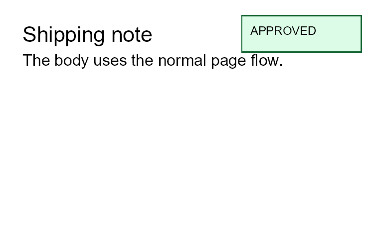

# Areas

Previous: [First document](first-document.md) | [Manual home](index.md) | Next: [Template data](template-data.md)

## What Is This?

An area is a fixed rectangle on the page.
It is defined inside the top-level `areas` section and contains normal controls such as `border`, `text`, `line` or
`image`.
Areas are rendered on every generated page.

The body flows from top to bottom and can continue on later pages.
An area does not join that flow.
It is placed by page coordinates such as `top`, `left`, `right` and `bottom`, then its content is clipped to the area
rectangle.

## When Should I Use This?

Use areas when content must appear at a specific page position and should not move with the body.
Common uses include approval stamps, fold marks, fixed labels, page-corner notices and other repeatable marks.

Do not use areas for normal paragraphs, tables, invoice rows or report content.
Keep that content in `body` so the generator can lay it out across pages.

Use `header` or `footer` when content belongs in a repeated top or bottom band.
Use `background` or `foreground` for page-wide marks that are not limited to a smaller rectangle.

## How Do I Start?

Start with one small area.
Give it a width, a height and one horizontal plus one vertical position.

```xml
<?xml version="1.0" encoding="utf-8"?>
<template>
    <body>
        <text fontsize="16">Shipping note</text>
        <text>The body uses the normal page flow.</text>
    </body>
    <areas>
        <area width="32mm" height="10mm" right="4mm" top="4mm">
            <border background="#dcfce7" color="#166534" thickness="1pt" padding="2mm">
                <text fontsize="9">APPROVED</text>
            </border>
        </area>
    </areas>
</template>
```



## Position An Area

An `area` can use these attributes:

| Attribute | Use it for |
|-----------|------------|
| `left` | Distance from the left page edge. |
| `top` | Distance from the top page edge. |
| `right` | Distance from the right page edge. |
| `bottom` | Distance from the bottom page edge. |
| `width` | Fixed area width. |
| `height` | Fixed area height. |

Area values use the same length parser as layout attributes.
For area coordinates and sizes, prefer clear units such as `mm`, `cm`, `pt`, `px` or `%`.
For details, see [Lengths](layout-fundamentals.md#lengths).

Use one horizontal anchor and one vertical anchor for the easiest result.

```xml
<area width="35mm" height="8mm" left="5mm" top="5mm">
    <text fontsize="9">Top-left note</text>
</area>
```

```xml
<area width="35mm" height="8mm" right="5mm" bottom="5mm">
    <text fontsize="9">Bottom-right note</text>
</area>
```

If both `left` and `right` are set, the area width is the space between those two page edges.
In that case, `width` is ignored.
If both `top` and `bottom` are set, the area height is the space between those two page edges.
In that case, `height` is ignored.

```xml
<area left="10mm" right="10mm" bottom="8mm" height="8mm">
    <line thickness="1pt" length="100%" color="#64748b"/>
</area>
```

## What Space Does An Area Use?

Area coordinates are measured against the full page, not the body area.
Page margin, header and footer space do not move an area inward.

Inside the area, child controls receive the area rectangle as their available space.
If the content is larger than the rectangle, the area clips it.
Keep area content short and test the rendered result after changing font size, padding or border thickness.

## How Areas Layer With Other Sections

The generator renders areas above the normal body, header and footer content, but below `foreground`.
Use this order when deciding where a mark belongs:

| Need | Section to try first |
|------|----------------------|
| Behind everything on every page. | `background` |
| Normal flowing content. | `body` |
| Repeated top or bottom content. | `header` or `footer` |
| Fixed rectangle above body content. | `areas` |
| Overlay above areas and body content. | `foreground` |

## Common Area Mistakes

- Using `areas` for content that should flow. Use `body` for normal document content.
- Forgetting `width` or `height` when only one horizontal or vertical anchor is set. A missing size can leave no visible
  space.
- Expecting page margins to move an area. Area coordinates start at the page edge.
- Putting anything except `area` directly inside `areas`. The `areas` section only accepts `area` nodes.
- Letting area content grow too large. Area contents are clipped to the area rectangle.

## Next Steps

Read [First document](first-document.md) for the full template structure.
Read [Layout fundamentals](layout-fundamentals.md) for length, spacing and color formats.
Read [Controls](controls.md) to choose the controls that go inside an area.

Previous: [First document](first-document.md) | [Manual home](index.md) | Next: [Template data](template-data.md)
