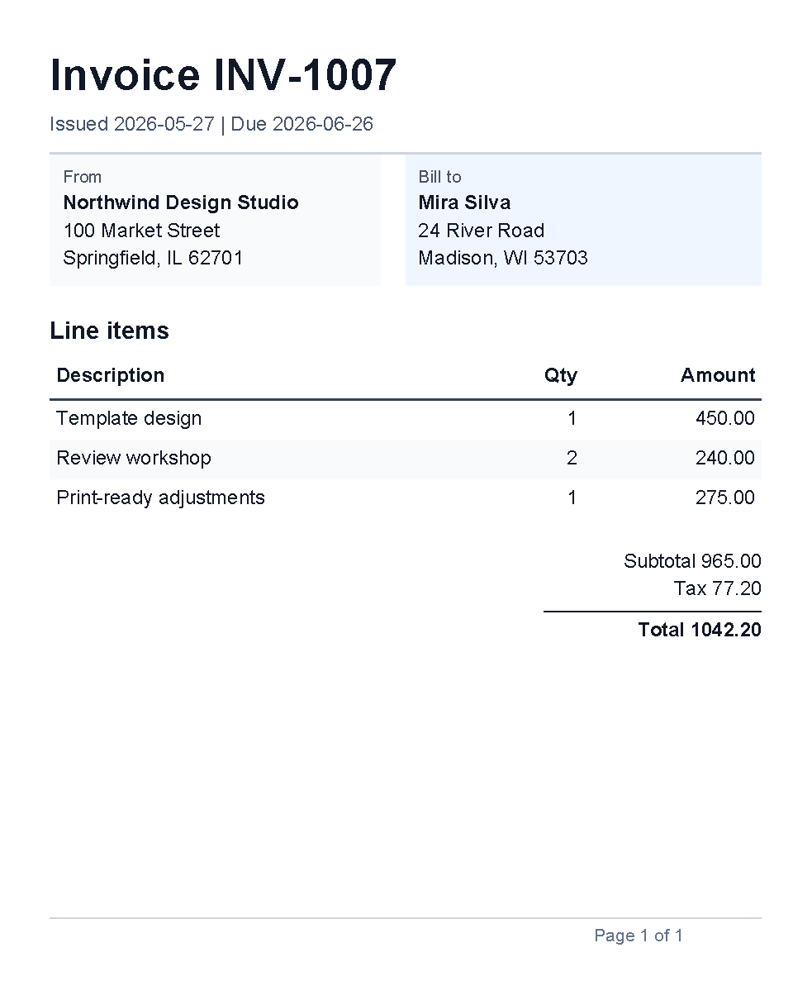
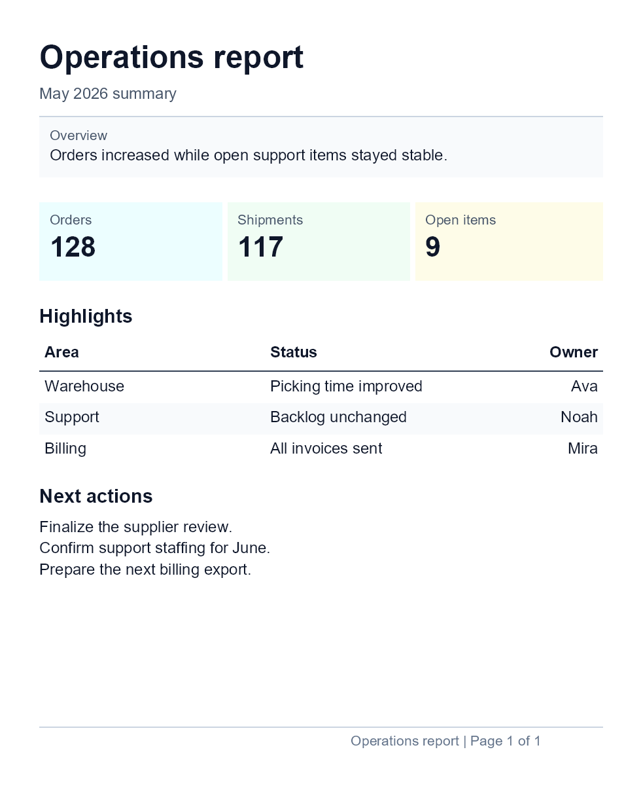
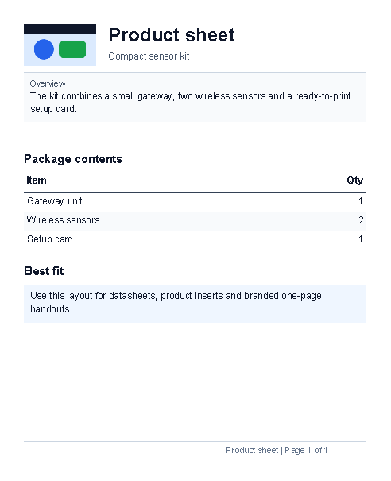

# Complete Examples

Previous: [Template language](template-language.md) | [Manual home](index.md) | Next: [Troubleshooting](troubleshooting.md)

Status: started. The invoice, report and product sheet previews on this page are verified by
`CompleteExampleDocumentationSamples`.

## What Is This?

Complete examples are larger templates that show several concepts working together in one document.
They are different from task examples because they demonstrate an end-to-end document shape, such as an invoice or report.

## When Should I Use This?

Use this chapter when you already understand the basic controls and want to see how a whole document is assembled.
Complete examples should be useful as reading material, not as a replacement for the smaller concept and task pages.

## How Do I Start?

Start with the example closest to your document type, then follow links back to the smaller chapters for individual concepts.
Each preview image is generated by a documentation sample test before it is added here.

## Invoice Example

Use this example when you need a compact invoice with a header, address blocks, a line-item table,
alternating row colors, totals and a footer page number.
It uses literal example values so the complete layout stays easy to read.
If your application supplies invoice values, replace the literal text with variables after the data shape is agreed with
the application developer.

This sample is generated by `CompleteExampleDocumentationSamples.CompleteExample_InvoicePreview`.

```xml
<?xml version="1.0" encoding="utf-8"?>
<template>
    <template.style>
        <text fontsize="9" foreground="#111827"/>
    </template.style>
    <header>
        <text fontsize="20" weight="bold">Invoice INV-1007</text>
        <text foreground="#475569">Issued 2026-05-27 | Due 2026-06-26</text>
        <line thickness="1pt" length="100%" color="#cbd5e1" margin="0 2mm 0 0"/>
    </header>
    <body>
        <table margin="0 0 0 5mm">
            <tr>
                <td width="1*">
                    <border background="#f8fafc" padding="2mm" margin="0 0 2mm 0">
                        <text fontsize="8" foreground="#475569">From</text>
                        <text weight="bold">Northwind Design Studio</text>
                        <text>100 Market Street</text>
                        <text>Springfield, IL 62701</text>
                    </border>
                </td>
                <td width="1*">
                    <border background="#eff6ff" padding="2mm">
                        <text fontsize="8" foreground="#475569">Bill to</text>
                        <text weight="bold">Mira Silva</text>
                        <text>24 River Road</text>
                        <text>Madison, WI 53703</text>
                    </border>
                </td>
            </tr>
        </table>

        <text fontsize="11" weight="bold" margin="0 0 0 1mm">Line items</text>
        <table>
            <th>
                <td width="2*">
                    <border thickness="0 0 0 1pt" color="#334155" padding="1mm">
                        <text weight="bold">Description</text>
                    </border>
                </td>
                <td width="1*">
                    <border thickness="0 0 0 1pt" color="#334155" padding="1mm">
                        <text weight="bold" horizontalAlignment="right">Qty</text>
                    </border>
                </td>
                <td width="1*">
                    <border thickness="0 0 0 1pt" color="#334155" padding="1mm">
                        <text weight="bold" horizontalAlignment="right">Amount</text>
                    </border>
                </td>
            </th>
            @alternate on RowBackground with ["#ffffff", "#f8fafc"] {
            <tr>
                <td><border background="@RowBackground" padding="1mm"><text>Template design</text></border></td>
                <td><border background="@RowBackground" padding="1mm"><text horizontalAlignment="right">1</text></border></td>
                <td><border background="@RowBackground" padding="1mm"><text horizontalAlignment="right">450.00</text></border></td>
            </tr>
            }
            @alternate on RowBackground {
            <tr>
                <td><border background="@RowBackground" padding="1mm"><text>Review workshop</text></border></td>
                <td><border background="@RowBackground" padding="1mm"><text horizontalAlignment="right">2</text></border></td>
                <td><border background="@RowBackground" padding="1mm"><text horizontalAlignment="right">240.00</text></border></td>
            </tr>
            }
            @alternate on RowBackground {
            <tr>
                <td><border background="@RowBackground" padding="1mm"><text>Print-ready adjustments</text></border></td>
                <td><border background="@RowBackground" padding="1mm"><text horizontalAlignment="right">1</text></border></td>
                <td><border background="@RowBackground" padding="1mm"><text horizontalAlignment="right">275.00</text></border></td>
            </tr>
            }
        </table>

        <text margin="0 5mm 0 0" horizontalAlignment="right">Subtotal 965.00</text>
        <text horizontalAlignment="right">Tax 77.20</text>
        <line thickness="1pt" length="35mm" color="#111827" horizontalAlignment="right" margin="0 1mm"/>
        <text weight="bold" horizontalAlignment="right">Total 1042.20</text>
    </body>
    <footer>
        <line thickness="1pt" length="100%" color="#cbd5e1" margin="0 0 0 1mm"/>
        <pageNumber
            mode="CurrentTotal"
            prefix="Page "
            delimiter=" of "
            fontsize="8"
            foreground="#64748b"
            horizontalAlignment="right"/>
    </footer>
</template>
```



This example combines smaller topics from [First document](first-document.md), [Styles](styles.md),
[Border control](controls-border.md), [Line control](controls-line.md), [Table control](controls-table.md),
[Page number control](controls-page-number.md) and [Template language](template-language.md).

## Report Example

Use this example when you need a short report page with a repeated header, a footer page number,
summary cards, a status table and a small action list.
It keeps the data literal so the layout is clear before you connect it to application data.

This sample is generated by `CompleteExampleDocumentationSamples.CompleteExample_ReportPreview`.

```xml
<?xml version="1.0" encoding="utf-8"?>
<template>
    <template.style>
        <text fontsize="9" foreground="#0f172a"/>
    </template.style>
    <header>
        <text fontsize="18" weight="bold">Operations report</text>
        <text foreground="#475569">May 2026 summary</text>
        <line thickness="1pt" length="100%" color="#cbd5e1" margin="0 2mm 0 0"/>
    </header>
    <body>
        <border background="#f8fafc" padding="2mm" margin="0 0 0 5mm" verticalAlignment="top">
            <text fontsize="8" foreground="#475569">Overview</text>
            <text>Orders increased while open support items stayed stable.</text>
        </border>

        <table margin="0 0 0 5mm">
            <tr>
                <td width="1*">
                    <border background="#ecfeff" padding="2mm" margin="0 0 1mm 0">
                        <text fontsize="8" foreground="#475569">Orders</text>
                        <text fontsize="16" weight="bold">128</text>
                    </border>
                </td>
                <td width="1*">
                    <border background="#f0fdf4" padding="2mm" margin="0 0 1mm 0">
                        <text fontsize="8" foreground="#475569">Shipments</text>
                        <text fontsize="16" weight="bold">117</text>
                    </border>
                </td>
                <td width="1*">
                    <border background="#fefce8" padding="2mm">
                        <text fontsize="8" foreground="#475569">Open items</text>
                        <text fontsize="16" weight="bold">9</text>
                    </border>
                </td>
            </tr>
        </table>

        <text fontsize="11" weight="bold" margin="0 0 0 1mm">Highlights</text>
        <table>
            <th>
                <td width="2*">
                    <border thickness="0 0 0 1pt" color="#334155" padding="1mm">
                        <text weight="bold">Area</text>
                    </border>
                </td>
                <td width="2*">
                    <border thickness="0 0 0 1pt" color="#334155" padding="1mm">
                        <text weight="bold">Status</text>
                    </border>
                </td>
                <td width="1*">
                    <border thickness="0 0 0 1pt" color="#334155" padding="1mm">
                        <text weight="bold" horizontalAlignment="right">Owner</text>
                    </border>
                </td>
            </th>
            <tr>
                <td><border padding="1mm"><text>Warehouse</text></border></td>
                <td><border padding="1mm"><text>Picking time improved</text></border></td>
                <td><border padding="1mm"><text horizontalAlignment="right">Ava</text></border></td>
            </tr>
            <tr>
                <td><border padding="1mm" background="#f8fafc"><text>Support</text></border></td>
                <td><border padding="1mm" background="#f8fafc"><text>Backlog unchanged</text></border></td>
                <td><border padding="1mm" background="#f8fafc"><text horizontalAlignment="right">Noah</text></border></td>
            </tr>
            <tr>
                <td><border padding="1mm"><text>Billing</text></border></td>
                <td><border padding="1mm"><text>All invoices sent</text></border></td>
                <td><border padding="1mm"><text horizontalAlignment="right">Mira</text></border></td>
            </tr>
        </table>

        <text fontsize="11" weight="bold" margin="0 4mm 0 1mm">Next actions</text>
        <text>Finalize the supplier review.</text>
        <text>Confirm support staffing for June.</text>
        <text>Prepare the next billing export.</text>
    </body>
    <footer>
        <line thickness="1pt" length="100%" color="#cbd5e1" margin="0 0 0 1mm"/>
        <pageNumber
            mode="CurrentTotal"
            prefix="Operations report | Page "
            delimiter=" of "
            fontsize="8"
            foreground="#64748b"
            horizontalAlignment="right"/>
    </footer>
</template>
```



This example combines smaller topics from [First document](first-document.md), [Border control](controls-border.md),
[Line control](controls-line.md), [Table control](controls-table.md) and
[Page number control](controls-page-number.md).

## Product Sheet Example

Use this example when you need a branded one-page handout with a logo or product image, short descriptive text,
a small table and a footer page number.
It uses one image value supplied by the application as `LogoImage`.

This sample is generated by `CompleteExampleDocumentationSamples.CompleteExample_ProductSheetPreview`.

```xml
<?xml version="1.0" encoding="utf-8"?>
<template>
    <template.style>
        <text fontsize="9" foreground="#0f172a"/>
    </template.style>
    <header>
        <table>
            <tr>
                <td width="28mm">
                    <image
                        source="@LogoImage"
                        width="24mm"
                        height="14mm"
                        horizontalAlignment="left"
                        verticalAlignment="top"/>
                </td>
                <td width="2*">
                    <text fontsize="18" weight="bold">Product sheet</text>
                    <text foreground="#475569">Compact sensor kit</text>
                </td>
            </tr>
        </table>
        <line thickness="1pt" length="100%" color="#cbd5e1" margin="0 2mm 0 0"/>
    </header>
    <body>
        <border background="#f8fafc" padding="2mm" margin="0 0 0 5mm" verticalAlignment="top">
            <text fontsize="8" foreground="#475569">Overview</text>
            <text>The kit combines a small gateway, two wireless sensors and a ready-to-print setup card.</text>
        </border>

        <text fontsize="11" weight="bold" margin="0 5mm 0 1mm">Package contents</text>
        <table>
            <th>
                <td width="2*">
                    <border thickness="0 0 0 1pt" color="#334155" padding="1mm">
                        <text weight="bold">Item</text>
                    </border>
                </td>
                <td width="1*">
                    <border thickness="0 0 0 1pt" color="#334155" padding="1mm">
                        <text weight="bold" horizontalAlignment="right">Qty</text>
                    </border>
                </td>
            </th>
            <tr>
                <td><border padding="1mm"><text>Gateway unit</text></border></td>
                <td><border padding="1mm"><text horizontalAlignment="right">1</text></border></td>
            </tr>
            <tr>
                <td><border padding="1mm" background="#f8fafc"><text>Wireless sensors</text></border></td>
                <td><border padding="1mm" background="#f8fafc"><text horizontalAlignment="right">2</text></border></td>
            </tr>
            <tr>
                <td><border padding="1mm"><text>Setup card</text></border></td>
                <td><border padding="1mm"><text horizontalAlignment="right">1</text></border></td>
            </tr>
        </table>

        <text fontsize="11" weight="bold" margin="0 5mm 0 1mm">Best fit</text>
        <border background="#eff6ff" padding="2mm" verticalAlignment="top">
            <text>Use this layout for datasheets, product inserts and branded one-page handouts.</text>
        </border>
    </body>
    <footer>
        <line thickness="1pt" length="100%" color="#cbd5e1" margin="0 0 0 1mm"/>
        <pageNumber
            mode="CurrentTotal"
            prefix="Product sheet | Page "
            delimiter=" of "
            fontsize="8"
            foreground="#64748b"
            horizontalAlignment="right"/>
    </footer>
</template>
```



This example combines smaller topics from [Template data](template-data.md), [Image control](controls-image.md),
[Border control](controls-border.md), [Line control](controls-line.md), [Table control](controls-table.md) and
[Page number control](controls-page-number.md).

## Planned Work

- Add table-heavy and chart examples.
- Generate preview images for the remaining complete examples.

Previous: [Template language](template-language.md) | [Manual home](index.md) | Next: [Troubleshooting](troubleshooting.md)
