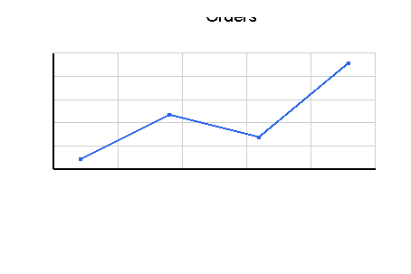
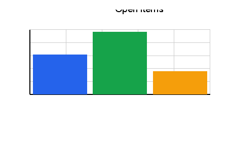
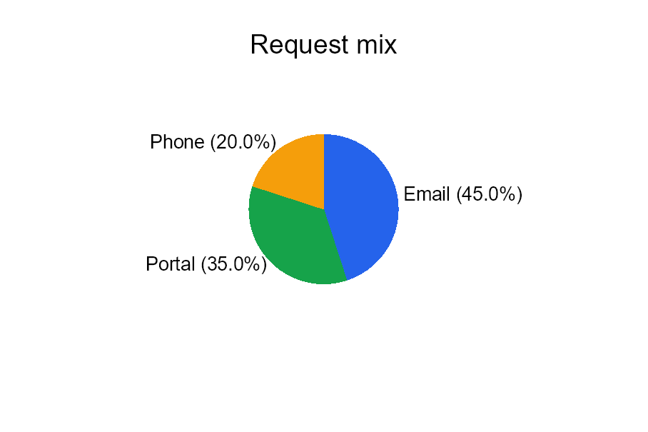

# Chart Controls

[Controls](controls.md) | [Manual home](index.md)

Status: started. The visual examples on this page are verified by `ChartDocumentationSamples`.
Attributes and child rules are checked against `ChartControl`, `ChartBaseControl`, `LineChart`,
`BarChart`, `PieChart`, `ChartDataControl` and the chart control tests.

## What Is This?

Chart controls draw simple data charts inside the document.
Use the outer `chart` control as the container, then place one or more chart types inside it:
`lineChart`, `barChart` or `pieChart`.

Each chart reads small `data` elements.
Line and bar charts use numeric `x` and `y` values.
Pie charts use numeric `y` values for slice sizes.

## When Should I Use This?

Use chart controls when the PDF should show a compact visual summary, such as orders over time,
open items by category or a share of totals.

Use a table instead when readers need exact row-by-row values.
Use text or a border when the value is a single number or status.

## How Do I Start?

Start with one `chart` container and one chart inside it.
Give the chart a fixed `height`, then add a few `data` rows.
This sample is generated by `ChartDocumentationSamples.Chart_LineTrend`.

```xml
<?xml version="1.0" encoding="utf-8"?>
<template>
    <body>
        <chart>
            <lineChart height="55mm" title="Orders" line-color="#2563eb">
                <data x="0" y="18"/>
                <data x="1" y="24"/>
                <data x="2" y="21"/>
                <data x="3" y="31"/>
            </lineChart>
        </chart>
    </body>
</template>
```



## Create A Bar Chart

Use `barChart` when separate values should be compared side by side.
The default orientation is vertical.
For horizontal bars, set `orientation="Horizontal"`; the shared values are listed in
[Orientation values](layout-fundamentals.md#orientation-values).
Set `color` on individual `data` elements when each bar should have its own color.

This sample is generated by `ChartDocumentationSamples.Chart_BarValues`.

```xml
<?xml version="1.0" encoding="utf-8"?>
<template>
    <body>
        <chart>
            <barChart height="55mm" title="Open items">
                <data x="0" y="12" color="#2563eb"/>
                <data x="1" y="19" color="#16a34a"/>
                <data x="2" y="7" color="#f59e0b"/>
            </barChart>
        </chart>
    </body>
</template>
```



## Create A Pie Chart

Use `pieChart` when each value is part of one total.
Pie chart slices need `y` values; `x` is optional.
Use `label` when the slice name should be drawn, and keep labels short so they fit inside the chart area.

This sample is generated by `ChartDocumentationSamples.Chart_PieShare`.

```xml
<?xml version="1.0" encoding="utf-8"?>
<template>
    <body>
        <chart>
            <pieChart height="60mm" title="Request mix">
                <data y="45" label="Email" color="#2563eb"/>
                <data y="35" label="Portal" color="#16a34a"/>
                <data y="20" label="Phone" color="#f59e0b"/>
            </pieChart>
        </chart>
    </body>
</template>
```



## Provide Chart Data

Keep chart data numeric and small.
The current controls parse values with invariant number formatting, so use `3.5` rather than a localized decimal comma.

Line and bar chart `data` elements need both `x` and `y`.
Pie chart `data` elements need `y`; when `x` is omitted, the control can still render the slice.

```xml
<lineChart height="40mm">
    <data x="0" y="10"/>
    <data x="1" y="15"/>
</lineChart>
```

Invalid or missing values are ignored by the chart data parser.
If no valid data remains, the chart renders a "No Data" message.

## Supported Attributes

`chart` supports the shared `margin`, `padding`, `clip`, `horizontalAlignment` and `verticalAlignment`
attributes described in [Layout fundamentals](layout-fundamentals.md).

`lineChart`, `barChart` and `pieChart` support these shared chart attributes:

| Attribute | Use it for | Values |
|-----------|------------|--------|
| `width` | Chart width. | Any supported length or percent value, default `100%`. |
| `height` | Chart height. | Any supported length or percent value, default `300px`. |
| `title` | Title text drawn above the chart. | Text. |
| `show-grid` | Show grid lines on line and bar charts. | `true` or `false`, default `true`. |
| `grid-color` | Grid line color. | Any supported color, default light gray. |
| `axis-color` | Axis and title text color. | Any supported color, default black. |
| `show-x-axis` | Show the horizontal axis on line and bar charts. | `true` or `false`, default `true`. |
| `show-y-axis` | Show the vertical axis on line and bar charts. | `true` or `false`, default `true`. |

`lineChart` also supports:

| Attribute | Use it for | Values |
|-----------|------------|--------|
| `line-thickness` | Stroke thickness of the line. | Any supported length, default `2px`. |
| `line-color` | Stroke and point color. | Any supported color, default first chart palette color. |
| `show-points` | Draw point markers. | `true` or `false`, default `true`. |
| `point-size` | Size of point markers. | Number, default `4`. |

`barChart` also supports:

| Attribute | Use it for | Values |
|-----------|------------|--------|
| `orientation` | Vertical or horizontal bars. | `Vertical` or `Horizontal`, default `Vertical`. |
| `bar-width` | Fixed bar width; `0` lets the control calculate it. | Any supported length, default `0px`. |
| `bar-spacing` | Spacing between bars. | Percent-style length, default `10%`. |
| `bar-color` | Default bar color. | Any supported color, default first chart palette color. |

`pieChart` also supports:

| Attribute | Use it for | Values |
|-----------|------------|--------|
| `start-angle` | Starting angle in degrees. | Number, default `0`. |
| `inner-radius` | Donut-hole radius. | Percent or length, default `0%`. |
| `show-percentages` | Draw percentage text beside slices. | `true` or `false`, default `true`. |
| `show-labels` | Draw slice labels from `data label`. | `true` or `false`, default `true`. |

`data` supports:

| Attribute | Use it for | Values |
|-----------|------------|--------|
| `x` | X value for line and bar charts. | Invariant numeric text. |
| `y` | Y value or pie slice size. | Invariant numeric text. |
| `label` | Visible pie slice label. | Short text. |
| `color` | Color for a bar or pie slice. | Any supported color. |

The source also defines `x-axis-label`, `y-axis-label`, `x-label` and `y-label`, but the verified render paths do
not draw those labels yet. Do not rely on them for visible chart text.

## Allowed Children

`chart` can contain chart controls: `lineChart`, `barChart` and `pieChart`.
Each chart control can contain `data`.
`data` is a leaf control and does not render by itself.

Multiple charts inside one `chart` container are stacked vertically.

## Common Mistakes

- Putting `data` directly inside `chart`. Put `data` inside `lineChart`, `barChart` or `pieChart`.
- Omitting chart `height`; the default may be too large or too small for the surrounding page section.
- Using text labels as `x` or `y`. The chart parser expects numeric values.
- Expecting bar or line charts to draw category labels from `label`, `x-label` or `y-label`.
- Using a chart when a small table would communicate the exact values more clearly.

[Controls](controls.md) | [Manual home](index.md)
