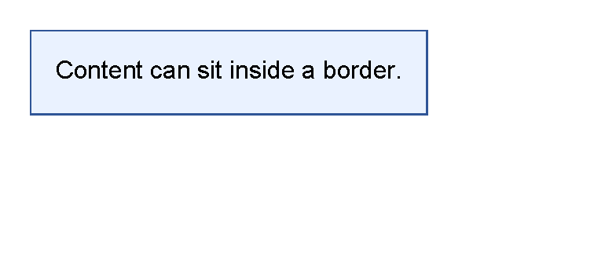

# Control Concepts

[Controls](controls.md) | [Manual home](index.md)

## What Is This?

A control is one visible document part written as an XML element.
For example, `text` draws words, `line` draws a separator, `image` draws an image,
`border` draws a box around content, and `table` arranges rows and cells.

Controls are the building blocks inside `body`, `header`, `footer`, areas and other containers.

## When Should I Use This?

Use this page when you are unsure which XML element should hold a piece of content,
or when an error says a control does not allow a child control.

The focused control pages explain each control's attributes.
This page explains the mental model behind all of them.

## How Do I Start?

Start by deciding whether the document part is content or a container.

Use a leaf control when the part draws itself and does not need children.

```xml
<?xml version="1.0" encoding="utf-8"?>
<template>
    <body>
        <text fontsize="18">Hello from a template</text>
    </body>
</template>
```


Use a container control when other controls need to sit inside it.

```xml
<?xml version="1.0" encoding="utf-8"?>
<template>
    <body>
        <border
            thickness="1pt"
            color="#2f5597"
            background="#eaf2ff"
            padding="4mm"
            horizontalAlignment="left"
            verticalAlignment="top">
            <text>Content can sit inside a border.</text>
        </border>
    </body>
</template>
```



## Leaf Controls

Leaf controls render their own content and do not contain child controls.
Common leaf controls include `text`, `line`, `image` and `pageNumber`.

Write the value directly in the element text or attributes:

For example, use `<text>Total</text>`, `<line thickness="1pt" length="100%"/>` or
`<pageNumber mode="CurrentTotal" prefix="Page " delimiter=" of "/>`.

If a leaf control needs a box, background, margin group or table cell, put the leaf inside a container.

## Container Controls

Container controls hold other controls.
Common containers include `border`, `table`, `tr`, `th`, `td`, `body`, `header`, `footer` and fixed `area` content.

Some containers allow many child control types.
For example, `border` and `td` can contain visible controls such as `text`, `line`, `image` or another `table`.

Some containers allow only specific children:

| Container | Allowed child pattern |
|-----------|-----------------------|
| `table` | `th` and `tr` rows. |
| `th` | `td` cells. |
| `tr` | `td` cells. |
| `td` | Visible controls, stacked vertically. |

## How Layout Happens

When a PDF is generated, controls are laid out before they are drawn.
For template authors, the practical rule is:

- The parent gives a control available space.
- The control decides how much space it needs.
- The control is placed in the available space.
- The control draws itself and, if it is a container, draws its children.

This is why `margin`, `padding`, `thickness`, alignment and table column widths can change where later content appears.
For the shared layout rules, see [Layout fundamentals](layout-fundamentals.md).

## Common Mistakes

- Putting `text` directly inside `table` instead of inside `td`.
- Putting child controls inside `text`, `line`, `image` or `pageNumber`.
- Expecting `table` itself to draw borders. Use `background`, `borderThickness` and `borderColor` on `th`, `tr` or `td`.
- Using a table when a single `border` would be enough.
- Adding several layout changes at once instead of testing one small control at a time.

For symptom-based help, see [Troubleshooting](troubleshooting.md).

[Controls](controls.md) | [Manual home](index.md)
