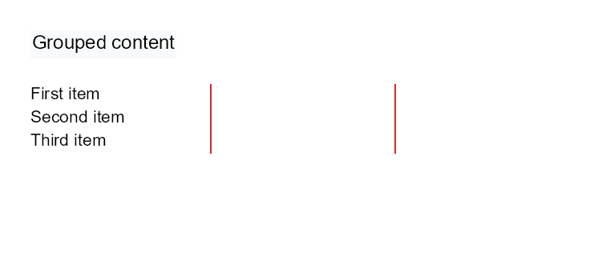

# Flow Helper Controls

Previous: [Rich text controls](controls-rich-text.md) | [Controls](controls.md) | Next: [List controls](controls-lists.md)

## What Is This?

Flow helper controls affect how visible controls are grouped, spaced, split across pages or arranged into columns.
They are built-in Papercraft Core controls registered by the normal service setup.

## When Should I Use This?

Use these controls when the document needs structure around other visible controls:

- Use `block` to group stacked controls, keep the group together and optionally add a background or page break behavior.
- Use `spacer` to reserve blank space.
- Use `pageBreak` to advance body flow to the next page.
- Use `columns` to flow whole child controls through multiple columns.

Use [`table`](controls-table.md) instead when the content is tabular rows and cells.

## How Do I Start?

These fragments mirror `BlockControlTests`, `FlowControlTests` and `ColumnsControlTests`:

```xml
<block background="#f8fafc" minHeight="12px" padding="2px">
    <text fontsize="9">Grouped content</text>
</block>

<spacer height="4mm"/>

<columns count="3" gap="7px" ruleThickness="2px" ruleColor="#dc2626">
    <text fontsize="8">First item</text>
    <text fontsize="8">Second item</text>
    <text fontsize="8">Third item</text>
</columns>
```



`block` and `columns` can contain normal controls.
`spacer` and `pageBreak` are leaf controls and should not contain child controls.
Use `<pageBreak/>`, `pageBreakBefore` or `pageBreakAfter` when a flow section should move to another page.
When a `block` fits on an empty body page but not in the remaining body space, Papercraft moves the whole block to
the next page before rendering its children. If a block is taller than a full body page, Papercraft renders it in normal
flow so child controls can continue across pages instead of looping forever.

## Supported Controls

| Control | Children | Use |
|---------|----------|-----|
| `block` | Normal controls | Stack children vertically, keep the group together when it fits on an empty body page, draw an optional background and request page breaks before or after the group. |
| `spacer` | None | Reserve empty width and height without drawing. |
| `pageBreak` | None | Advance body flow to the next page when not already at a page boundary. |
| `columns` | Normal controls | Flow whole child controls through a configured number of columns. |

## Supported Attributes

| Control | Attributes |
|---------|------------|
| `block` | `background`, `minHeight`, `pageBreakBefore`, `pageBreakAfter`, shared layout attributes. |
| `spacer` | `width`, `height`, shared alignment attributes. |
| `pageBreak` | Shared layout attributes only; no control-specific attributes. |
| `columns` | `count`, `gap`, `ruleThickness` or `rule-thickness`, `ruleColor` or `rule-color`, shared layout attributes. |

For length values and shared layout attributes, see [Layout fundamentals](layout-fundamentals.md).

## Common Mistakes

- Using `columns` for data tables. Use [`table`](controls-table.md) when rows and cells matter.
- Assuming `columns` splits a child control between columns. It flows whole child controls.
- Expecting `spacer` or `pageBreak` to draw visible output.
- Using `pageBreak` in fixed areas where normal body flow is not the main layout mechanism.

Previous: [Rich text controls](controls-rich-text.md) | [Controls](controls.md) | Next: [List controls](controls-lists.md)
