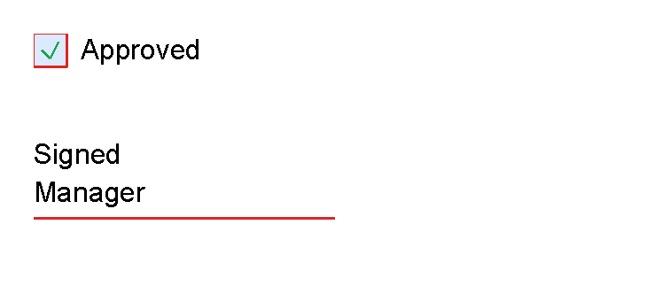
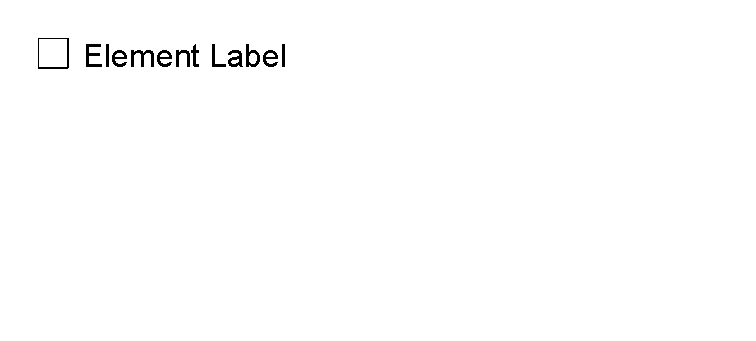

# Form And Signing Controls

Previous: [List controls](controls-lists.md) | [Controls](controls.md) | Next: [Chart controls](controls-chart.md)

## What Is This?

Form and signing controls draw simple document marks:
`checkbox` draws a checkbox square with optional label or child content, and `signature` draws a signature line
with optional helper text.

These are visual PDF controls.
They do not create interactive PDF form fields.

## When Should I Use This?

Use `checkbox` for checklist rows, approvals or status marks.
Use `signature` for a printed signing placeholder.

Use normal application data and template language when the checked state or label should come from data.

## How Do I Start?

These fragments mirror `CheckboxControlTests` and `SignatureControlTests`:

```xml
<checkbox
    checked="true"
    size="5mm"
    label="Approved"
    gap="2mm"
    strokeColor="#dc2626"
    fill="#dbeafe"
    checkColor="#16a34a"
    strokeThickness="1pt"/>

<signature
    height="16mm"
    lineWidth="45mm"
    lineThickness="1pt"
    lineColor="#dc2626"
    label="Signed"
    subtext="Manager"
    textPlacement="Above"/>
```



`checkbox` can also use element text as its label:

```xml
<checkbox>Element Label</checkbox>
```



When `checkbox` has a non-empty `label`, the label text wins over child controls.
Without a label, child controls render to the right of the checkbox square.

## Supported Controls

| Control | Children | Use |
|---------|----------|-----|
| `checkbox` | Optional normal controls | Checkbox square with optional check mark, label or child content. |
| `signature` | None | Signature line with optional label and subtext. |

## Supported Attributes

| Control | Attributes |
|---------|------------|
| `checkbox` | `checked`, `size`, `label` or element content, `gap`, `strokeColor`, `fill`, `checkColor`, `strokeThickness`, shared layout attributes. |
| `signature` | `height`, `lineWidth`, `lineThickness`, `lineColor`, `label`, `subtext`, `textPlacement`, text styling attributes and shared alignment attributes. |

`signature textPlacement` accepts `Below` or `Above`.
For text styling attributes, see [Text control](controls-text.md#supported-attributes).
For length values and shared layout attributes, see [Layout fundamentals](layout-fundamentals.md).

## Common Mistakes

- Expecting these controls to create interactive PDF fields. They draw static PDF content.
- Putting child controls inside `signature`; it is a leaf control.
- Setting both a `checkbox` label and child content when you expect both to render. The label takes precedence.

Previous: [List controls](controls-lists.md) | [Controls](controls.md) | Next: [Chart controls](controls-chart.md)
