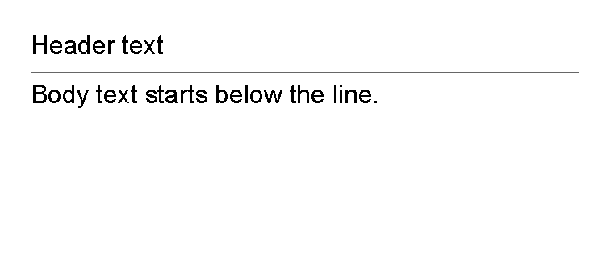
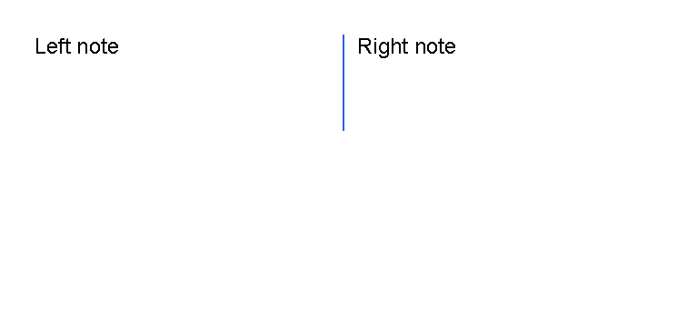
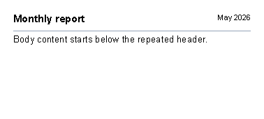

# Line Control

[Controls](controls.md) | [Manual home](index.md)

## What Is This?

The `line` control draws a straight horizontal or vertical line.
It is a leaf control: it renders a line by itself and does not contain other controls.

Use lines as simple separators between sections, header rules, footer rules or small visual marks.

## When Should I Use This?

Use `line` when the document needs one straight rule.
Use `border` instead when content needs a box, a background color or a border on one side of a container.

A line is usually a small supporting element.
Keep the surrounding content in `text`, `border`, `table` or another control.

## How Do I Start?

Start with a horizontal separator between two text controls.

```xml
<?xml version="1.0" encoding="utf-8"?>
<template>
    <body>
        <text>Header text</text>
        <line thickness="1pt" length="100%" color="#666666" margin="0 1mm"/>
        <text>Body text starts below the line.</text>
    </body>
</template>
```



## Draw A Horizontal Line

Leave `orientation` unset, or set it to `Horizontal`, when the line should run from left to right.
For a simple separator, give the line a small `thickness`, a useful `length` and a little vertical margin:

```xml
<line thickness="1pt" length="100%" color="#666666" margin="0 1mm"/>
```


### Choose Length And Thickness

Use `length` for how far the line travels.
Use `thickness` for how wide the stroke is.
For shared value formats, see [Lengths](layout-fundamentals.md#lengths) and
[Thickness values](layout-fundamentals.md#thickness-values).

For a horizontal line, `length` is measured along the available width and `thickness` uses the vertical axis.
For a vertical line, `length` is measured along the available height and `thickness` uses the horizontal axis.

Set both values explicitly for predictable output.
The default length and thickness are `auto`, which means the line can fill the available space.

## Change Color

Use `color` to set the line color.
The value uses the same color formats documented in [Layout fundamentals](layout-fundamentals.md).

Common examples:

| Need | Example value |
|------|---------------|
| Neutral rule | `#666666` |
| Light divider | `#d1d5db` |
| Brand accent | `#1d4ed8` |
| Named color | `red` |

## Use Vertical Lines

Set `orientation="vertical"` when the line should run from top to bottom.
The supported orientation values are `Horizontal` and `Vertical`; attribute binding accepts values case-insensitively.
For the shared value reference, see [Orientation values](layout-fundamentals.md#orientation-values).

Vertical lines are often easier to place inside a fixed area or a table cell than directly in the normal body flow.
For fixed-position content, see [First document](first-document.md#use-fixed-areas).


```xml
<?xml version="1.0" encoding="utf-8"?>
<template>
    <body>
        <table>
            <tr>
                <td width="2*">
                    <text fontsize="9">Left note</text>
                </td>
                <td width="4mm">
                    <line
                        orientation="vertical"
                        length="14mm"
                        thickness="1pt"
                        color="#2563eb"
                        horizontalAlignment="center"/>
                </td>
                <td width="2*">
                    <text fontsize="9">Right note</text>
                </td>
            </tr>
        </table>
    </body>
</template>
```



## Use Lines As Header Or Table Separators

Use a horizontal `line` after header content when every page should have the same rule under the heading.

```xml
<?xml version="1.0" encoding="utf-8"?>
<template>
    <header>
        <table>
            <tr>
                <td width="1*">
                    <text fontsize="11" weight="bold">Monthly report</text>
                </td>
                <td width="1*">
                    <text fontsize="8" horizontalAlignment="right">May 2026</text>
                </td>
            </tr>
        </table>
        <line thickness="1pt" length="100%" color="#94a3b8" margin="0 1mm"/>
    </header>
    <body>
        <text fontsize="10">Body content starts below the repeated header.</text>
    </body>
</template>
```



Inside a table, use a vertical `line` in a narrow `td` when it should separate two neighboring blocks.
Use a `border` with bottom thickness instead when every row needs a horizontal rule.
For that row-rule pattern, see [Draw Only A Bottom Border](controls-border.md#draw-only-a-bottom-border).

## Supported Attributes

| Attribute | Use it for | Values |
|-----------|------------|--------|
| `thickness` | Stroke thickness. | Any supported length, default `auto`. |
| `length` | Line length. | Any supported length, default `auto`. |
| `orientation` | Horizontal or vertical direction. | `Horizontal` or `Vertical`, default `Horizontal`. |
| `color` | Stroke color. | Any supported color, default `black`. |

The `line` control also supports the shared `margin`, `padding`, `clip`, `horizontalAlignment`
and `verticalAlignment` attributes described in [Layout fundamentals](layout-fundamentals.md).

## Allowed Children

`line` does not allow child controls or text content.
Use it as a self-closing element, such as `<line thickness="1pt" length="100%" color="#666666"/>`.

## Common Mistakes

- Omitting `thickness` or `length`; the defaults are usually too large for a separator.
- Using `line` for a content box. Use `border` when content needs an outline or background.
- Forgetting margin around the line, which can leave adjacent text too close to the rule.
- Setting a vertical line in normal body flow when a fixed `area` or table cell would be easier to control.

[Controls](controls.md) | [Manual home](index.md)
