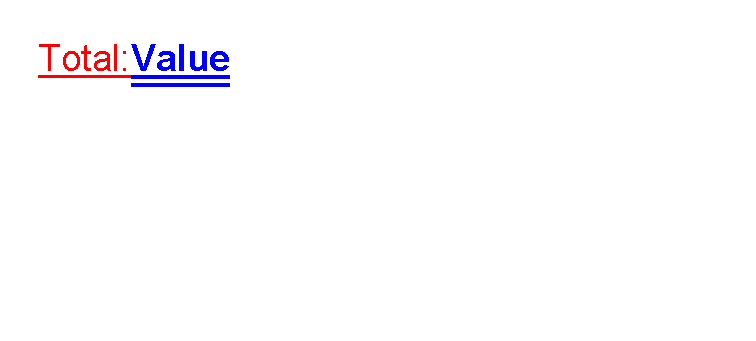

# Rich Text Controls

Previous: [Text control](controls-text.md) | [Controls](controls.md) | Next: [Flow helper controls](controls-flow.md)

## What Is This?

Rich text controls let one paragraph contain multiple inline text fragments.
Use `paragraph` as the container, `span` for inline text runs and `br` for an explicit line break.
Use `hyperlink` when a single link-style text control is enough.

## When Should I Use This?

Use `paragraph` when a line needs mixed text styling, such as a normal label followed by a bold value.
Use `hyperlink` when the template should draw link-styled text and create a clickable PDF link from `href`.

Use [`text`](controls-text.md) instead when all words in the control share one style.

## How Do I Start?

This fragment mirrors the activation coverage in `ParagraphControlTests`:

```xml
<paragraph foreground="red" fontsize="14" lineheight="1.5" decoration="underline">
    <span>Total: </span>
    <span foreground="blue" weight="bold" decoration="doubleUnderline">Value</span>
    <br/>
</paragraph>
```



`paragraph` accepts only `span` and `br` children.
Do not put `text`, `image`, `table` or other normal controls directly inside a paragraph.

For link-style text, use `hyperlink`.
This fragment mirrors `HyperlinkControlTests`:

```xml
<hyperlink
    href="https://example.test/invoice/123"
    underline="false"
    foreground="red"
    fontsize="14">View invoice</hyperlink>
```


PDF output creates clickable URI annotations for the visible link text. Raster output keeps the visible text and optional
underline, but cannot carry clickable PDF annotations.

## Supported Controls

| Control | Children | Use |
|---------|----------|-----|
| `paragraph` | `span`, `br` | Rich text paragraph with inline runs and explicit line breaks. |
| `span` | None | Inline text run inside `paragraph`. |
| `br` | None | Explicit line break inside `paragraph`. |
| `hyperlink` | None | Link-style text with optional underline and a clickable PDF `href` target. |

## Supported Attributes

| Control | Attributes |
|---------|------------|
| `paragraph` | Text styling attributes: `foreground`, `fontsize`, `lineheight`, `scale`, `rotation`, `strokethickness`, `decoration`, `letterspacing`, `weight`, `style`, `fontfamily`; shared layout attributes. |
| `span` | `text` or element content, plus optional text styling overrides: `foreground`, `fontsize`, `lineheight`, `scale`, `rotation`, `strokethickness`, `decoration`, `letterspacing`, `weight`, `style`, `fontfamily`. |
| `br` | Shared layout attributes only; no control-specific attributes. |
| `hyperlink` | `href`, `text` or element content, `underline`, `decoration`, text styling attributes and shared layout attributes. |

For shared `margin`, `padding`, `clip`, `horizontalAlignment` and `verticalAlignment`, see
[Layout fundamentals](layout-fundamentals.md).

## Common Mistakes

- Putting normal block controls inside `paragraph`. Use `span` and `br` only.
- Expecting `span` or `br` to render on their own outside `paragraph`.
- Expecting raster image output to contain clickable links. Only PDF output carries link annotations.
- Using `paragraph` for simple text that can be handled by [`text`](controls-text.md).

Previous: [Text control](controls-text.md) | [Controls](controls.md) | Next: [Flow helper controls](controls-flow.md)
