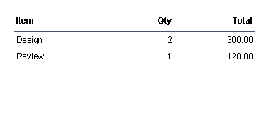
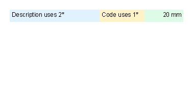
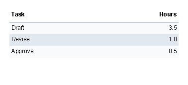

# Table Control

[Controls](controls.md) | [Manual home](index.md)

Status: started. The visual examples on this page are verified by `TableDocumentationSamples`.
Table structure and attributes are checked against `TableControl`, `TableHeaderControl`, `TableRowControl`,
`TableCellControl`, `TableRowControlBase`, `ColumnLength` and the table control tests.

## What Is This?

The `table` control arranges content into rows and columns.
It uses `th` for a table header row, `tr` for normal rows and `td` for cells.

Table controls create the layout only.
If the table needs visible grid lines, backgrounds or padding, put controls such as `border` and `text` inside the cells.

## When Should I Use This?

Use `table` when content belongs in columns: invoice line items, totals, small comparison blocks,
addresses side by side or values that should line up by column.

Do not use a table just to add a box around one piece of text.
Use [Border control](controls-border.md) for boxes and backgrounds, and use [Line control](controls-line.md)
for standalone separators.

## How Do I Start?

Start with one `table`, one header row and a few normal rows.
Each `th` or `tr` contains `td` cells.
This sample is generated by `TableDocumentationSamples.Table_BasicRowsAndColumns`.

```xml
<?xml version="1.0" encoding="utf-8"?>
<template>
    <body>
        <table>
            <th>
                <td>
                    <border thickness="0 0 0 1pt" color="#475569" padding="1mm">
                        <text fontsize="9" weight="bold">Item</text>
                    </border>
                </td>
                <td>
                    <border thickness="0 0 0 1pt" color="#475569" padding="1mm">
                        <text fontsize="9" weight="bold" horizontalAlignment="right">Qty</text>
                    </border>
                </td>
                <td>
                    <border thickness="0 0 0 1pt" color="#475569" padding="1mm">
                        <text fontsize="9" weight="bold" horizontalAlignment="right">Total</text>
                    </border>
                </td>
            </th>
            <tr>
                <td><border padding="1mm"><text fontsize="9">Design</text></border></td>
                <td><border padding="1mm"><text fontsize="9" horizontalAlignment="right">2</text></border></td>
                <td><border padding="1mm"><text fontsize="9" horizontalAlignment="right">300.00</text></border></td>
            </tr>
            <tr>
                <td><border padding="1mm"><text fontsize="9">Review</text></border></td>
                <td><border padding="1mm"><text fontsize="9" horizontalAlignment="right">1</text></border></td>
                <td><border padding="1mm"><text fontsize="9" horizontalAlignment="right">120.00</text></border></td>
            </tr>
        </table>
    </body>
</template>
```



## Set Column Widths

Use the `width` attribute on `td` cells to guide column sizing.
The table reads the width requests from cells in the same column.

Useful width forms are:

- `1*`, `2*` and similar star values for weighted parts of the remaining space.
- Lengths such as `20mm`, `2cm`, `72pt` or `25%`.
- `auto` when the column should use the measured content width.

This sample is generated by `TableDocumentationSamples.Table_ColumnWidths`.

```xml
<?xml version="1.0" encoding="utf-8"?>
<template>
    <body>
        <table>
            <tr>
                <td width="2*">
                    <border background="#e0f2fe" padding="1mm">
                        <text fontsize="9">Description uses 2*</text>
                    </border>
                </td>
                <td width="1*">
                    <border background="#fef3c7" padding="1mm">
                        <text fontsize="9">Code uses 1*</text>
                    </border>
                </td>
                <td width="20mm">
                    <border background="#dcfce7" padding="1mm">
                        <text fontsize="9" horizontalAlignment="right">20 mm</text>
                    </border>
                </td>
            </tr>
        </table>
    </body>
</template>
```



## Align Numbers To The Right

Use `horizontalAlignment="right"` on the `text` control inside a cell when numbers should line up on the right side.
The table controls position the cell; the text control positions the text inside that cell.

```xml
<td>
    <border padding="1mm">
        <text fontsize="9" horizontalAlignment="right">120.00</text>
    </border>
</td>
```

This pattern is used in `TableDocumentationSamples.Table_BasicRowsAndColumns`.

## Alternate Row Colors

Use `@alternate` to rotate through background colors.
Because `td` does not draw a background by itself, put a `border` inside each cell and set its `background`.

This sample is generated by `TableDocumentationSamples.Table_AlternatingRows`.

```xml
<?xml version="1.0" encoding="utf-8"?>
<template>
    <body>
        <table>
            <th>
                <td width="2*">
                    <border thickness="0 0 0 1pt" color="#334155" padding="1mm">
                        <text fontsize="9" weight="bold">Task</text>
                    </border>
                </td>
                <td width="1*">
                    <border thickness="0 0 0 1pt" color="#334155" padding="1mm">
                        <text fontsize="9" weight="bold" horizontalAlignment="right">Hours</text>
                    </border>
                </td>
            </th>
            @alternate on RowBackground with ["#f8fafc", "#e2e8f0"] {
            <tr>
                <td><border background="@RowBackground" padding="1mm"><text fontsize="9">Draft</text></border></td>
                <td><border background="@RowBackground" padding="1mm"><text fontsize="9" horizontalAlignment="right">3.5</text></border></td>
            </tr>
            }
            @alternate on RowBackground {
            <tr>
                <td><border background="@RowBackground" padding="1mm"><text fontsize="9">Revise</text></border></td>
                <td><border background="@RowBackground" padding="1mm"><text fontsize="9" horizontalAlignment="right">1.0</text></border></td>
            </tr>
            }
            @alternate on RowBackground {
            <tr>
                <td><border background="@RowBackground" padding="1mm"><text fontsize="9">Approve</text></border></td>
                <td><border background="@RowBackground" padding="1mm"><text fontsize="9" horizontalAlignment="right">0.5</text></border></td>
            </tr>
            }
        </table>
    </body>
</template>
```



For more transformer syntax, see [Template language](template-language.md).

## Supported Attributes

`table`, `th` and `tr` do not add table-specific XML attributes.
They support the shared `margin`, `padding`, `clip`, `horizontalAlignment` and `verticalAlignment` attributes
described in [Layout fundamentals](layout-fundamentals.md).

`td` supports those shared attributes plus:

| Attribute | Use it for | Values |
|-----------|------------|--------|
| `width` | Requested column width. | `auto`, any supported length or percent value, or star values such as `1*` and `2*`. |
| `columnSpan` | Make one cell span more than one column. | Whole number, default `1`; source notes that `0` is ignored. |

## Allowed Children

`table` can contain `th` and `tr`.
`th` and `tr` can contain `td`.
`td` can contain visible controls such as `text`, `border`, `line`, another `table` or other registered controls.

Children inside one `td` are stacked vertically.
A header row is rendered before normal rows, and `TableControl` renders header rows again when a table continues
after a page break.

## Common Mistakes

- Expecting `table`, `tr` or `td` to draw visible grid lines. Add `border` controls inside cells for lines and fills.
- Putting `text` directly inside `table` or `tr`. Put visible content inside a `td`.
- Forgetting that `th` is a table header row in this template language, not a header cell.
- Using table layout for a single highlighted box. Use `border` for that.
- Making one large table example before checking the smaller row, width and alignment pieces.

[Controls](controls.md) | [Manual home](index.md)
