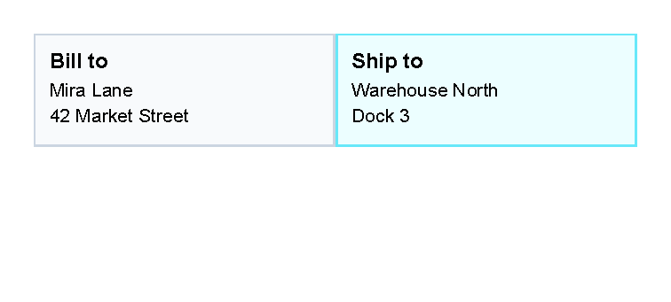
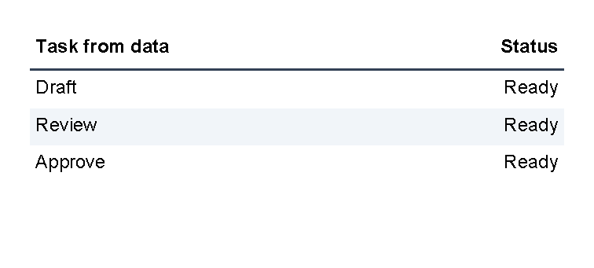

# Table Control

[Controls](controls.md) | [Manual home](index.md)

## What Is This?

The `table` control arranges content into rows and columns.
It uses `th` for a table header row, `tr` for normal rows and `td` for cells.

Table controls create the layout and can draw row or cell backgrounds and borders.
The `table` element itself is layout-only; put visible fills and rules on `th`, `tr` or `td`.
Use `td` padding for spacing inside cells.
Use `border` inside a cell only when the cell content itself needs a separate boxed layout.

## When Should I Use This?

Use `table` when content belongs in columns: invoice line items, totals, small comparison blocks,
addresses side by side or values that should line up by column.

Do not use a table just to add a box around one piece of text.
Use [Border control](controls-border.md) for boxes and backgrounds, and use [Line control](controls-line.md)
for standalone separators.

## How Do I Start?

Start with one `table`, one header row and a few normal rows.
Each `th` or `tr` contains `td` cells.

```xml
<?xml version="1.0" encoding="utf-8"?>
<template>
    <body>
        <table>
            <th borderThickness="0 0 0 1pt" borderColor="#475569">
                <td padding="1mm">
                    <text fontsize="9" weight="bold">Item</text>
                </td>
                <td padding="1mm">
                    <text fontsize="9" weight="bold" horizontalAlignment="right">Qty</text>
                </td>
                <td padding="1mm">
                    <text fontsize="9" weight="bold" horizontalAlignment="right">Total</text>
                </td>
            </th>
            <tr>
                <td padding="1mm"><text fontsize="9">Design</text></td>
                <td padding="1mm"><text fontsize="9" horizontalAlignment="right">2</text></td>
                <td padding="1mm"><text fontsize="9" horizontalAlignment="right">300.00</text></td>
            </tr>
            <tr>
                <td padding="1mm"><text fontsize="9">Review</text></td>
                <td padding="1mm"><text fontsize="9" horizontalAlignment="right">1</text></td>
                <td padding="1mm"><text fontsize="9" horizontalAlignment="right">120.00</text></td>
            </tr>
        </table>
    </body>
</template>
```


## Add A Table Header

Use `th` for a header row.
The header row uses the same `td` cells as normal rows, but `TableControl` treats it as the table header and repeats it
when the table continues on a later page.

```xml
<table>
    <th borderThickness="0 0 0 1pt" borderColor="#475569">
        <td padding="1mm"><text weight="bold">Item</text></td>
        <td padding="1mm"><text weight="bold">Total</text></td>
    </th>
    <tr>
        <td><text>Design</text></td>
        <td><text>300.00</text></td>
    </tr>
</table>
```


For page-break behavior and repeated headers, see
[A table breaks or overflows unexpectedly](troubleshooting.md#a-table-breaks-or-overflows-unexpectedly).

## Create A Two-Column Layout

Use one table row with two `td` cells when content should sit side by side.
Give both cells the same star width, such as `width="1*"`, when the columns should share the available width equally.
Use cell `background`, `borderThickness` and `borderColor` when the cell itself needs a visible box.


```xml
<?xml version="1.0" encoding="utf-8"?>
<template>
    <body>
        <table>
            <tr>
                <td
                    width="1*"
                    borderThickness="1pt"
                    borderColor="#cbd5e1"
                    background="#f8fafc"
                    padding="2mm"
                    verticalAlignment="top">
                    <text fontsize="9" weight="bold">Bill to</text>
                    <text fontsize="8">Mira Lane</text>
                    <text fontsize="8">42 Market Street</text>
                </td>
                <td
                    width="1*"
                    borderThickness="1pt"
                    borderColor="#67e8f9"
                    background="#ecfeff"
                    padding="2mm"
                    verticalAlignment="top">
                    <text fontsize="9" weight="bold">Ship to</text>
                    <text fontsize="8">Warehouse North</text>
                    <text fontsize="8">Dock 3</text>
                </td>
            </tr>
        </table>
    </body>
</template>
```



Use this pattern for addresses, small summary blocks or side-by-side labels.
For many repeated rows, keep using normal table rows instead of nesting large layouts inside one cell.

## Set Column Widths

Use the `width` attribute on `td` cells to guide column sizing.
The table reads the width requests from cells in the same column.

Useful width forms are:

- `1*`, `2*` and similar star values for weighted parts of the remaining space.
- Lengths such as `20mm`, `2cm`, `72pt` or `25%`.
- `auto` when the column should use the measured content width.

For fixed and percent length formats, see [Lengths](layout-fundamentals.md#lengths).


```xml
<?xml version="1.0" encoding="utf-8"?>
<template>
    <body>
        <table>
            <tr>
                <td width="2*" background="#e0f2fe" padding="1mm">
                    <text fontsize="9">Description uses 2*</text>
                </td>
                <td width="1*" background="#fef3c7" padding="1mm">
                    <text fontsize="9">Code uses 1*</text>
                </td>
                <td width="20mm" background="#dcfce7" padding="1mm">
                    <text fontsize="9" horizontalAlignment="right">20 mm</text>
                </td>
            </tr>
        </table>
    </body>
</template>
```


## Align Numbers To The Right

Use `horizontalAlignment="right"` on the `text` control inside a cell when numbers should line up on the right side.
The table controls position the cell; the text control positions the text inside that cell.

```xml
<td padding="1mm">
    <text fontsize="9" horizontalAlignment="right">120.00</text>
</td>
```


## Create An Invoice Line-Item Table

Use one `th` row for the column labels and one `tr` row for each line item.
Put visible padding on the `td` cells.
Use `background`, `borderThickness` and `borderColor` on rows or cells when the table needs fills or rules.
Right-align quantities, prices and totals with the `text` control.

The full invoice preview uses the same structure:

```xml
<table>
    <th borderThickness="0 0 0 1pt" borderColor="#334155">
        <td width="2*" padding="1mm"><text weight="bold">Description</text></td>
        <td width="1*" padding="1mm"><text weight="bold" horizontalAlignment="right">Qty</text></td>
        <td width="1*" padding="1mm"><text weight="bold" horizontalAlignment="right">Amount</text></td>
    </th>
    <tr>
        <td padding="1mm"><text>Design package</text></td>
        <td padding="1mm"><text horizontalAlignment="right">2</text></td>
        <td padding="1mm"><text horizontalAlignment="right">690.00</text></td>
    </tr>
</table>
```


For a full document shape, see the generated [Invoice example](complete-examples.md#invoice-example).
If invoice rows come from application data, start with [Repeat rows from data](#repeat-rows-from-data) when each row
can be represented by one simple value.
Multi-field invoice row objects are not documented as a supported template-author pattern yet; ask the application
team for prepared simple values or helper functions until a supported nested-data pattern exists.

## Alternate Row Colors

Use `@alternate` to rotate through background colors.
Set `background` on the row when the whole row should share the same fill.


```xml
<?xml version="1.0" encoding="utf-8"?>
<template>
    <body>
        <table>
            <th borderThickness="0 0 0 1pt" borderColor="#334155">
                <td width="2*" padding="1mm">
                    <text fontsize="9" weight="bold">Task</text>
                </td>
                <td width="1*" padding="1mm">
                    <text fontsize="9" weight="bold" horizontalAlignment="right">Hours</text>
                </td>
            </th>
            @alternate on RowBackground with ["#f8fafc", "#e2e8f0"] {
            <tr background="@RowBackground">
                <td padding="1mm"><text fontsize="9">Draft</text></td>
                <td padding="1mm"><text fontsize="9" horizontalAlignment="right">3.5</text></td>
            </tr>
            }
            @alternate on RowBackground {
            <tr background="@RowBackground">
                <td padding="1mm"><text fontsize="9">Revise</text></td>
                <td padding="1mm"><text fontsize="9" horizontalAlignment="right">1.0</text></td>
            </tr>
            }
            @alternate on RowBackground {
            <tr background="@RowBackground">
                <td padding="1mm"><text fontsize="9">Approve</text></td>
                <td padding="1mm"><text fontsize="9" horizontalAlignment="right">0.5</text></td>
            </tr>
            }
        </table>
    </body>
</template>
```


For more transformer syntax, see [Template language](template-language.md).

## Repeat Rows From Data

Use `@foreach` when the application supplies a list and the table should add one `tr` for each item.
Keep the repeated block small: one loop, one row and the cells that belong to that row.


```xml
<?xml version="1.0" encoding="utf-8"?>
<template>
    <body>
        <table>
            <th borderThickness="0 0 0 1pt" borderColor="#334155">
                <td width="2*" padding="1mm">
                    <text fontsize="9" weight="bold">Task from data</text>
                </td>
                <td width="1*" padding="1mm">
                    <text fontsize="9" weight="bold" horizontalAlignment="right">Status</text>
                </td>
            </th>
            @foreach TaskName in Tasks {
            @alternate on RowBackground with ["#ffffff", "#f1f5f9"] {
            <tr background="@RowBackground">
                <td padding="1mm"><text fontsize="9">@TaskName</text></td>
                <td padding="1mm"><text fontsize="9" horizontalAlignment="right">Ready</text></td>
            </tr>
            }
            }
        </table>
    </body>
</template>
```



The application must supply `Tasks` as a collection of text values.
The loop creates a temporary `TaskName` value for the current item.
The nested `@alternate` block is optional; it only rotates the row background colors.
Multi-field row objects are not documented as a supported template-author pattern yet.
For current nested-data guidance, see [Template data](template-data.md#nested-data).

## Supported Attributes

`table` supports the shared `margin`, `padding`, `clip`, `horizontalAlignment` and `verticalAlignment` attributes
described in [Layout fundamentals](layout-fundamentals.md).

`th` and `tr` support those shared attributes plus:

| Attribute | Use it for | Values |
|-----------|------------|--------|
| `background` | Fill behind the whole row. | Any supported color, default `transparent`. |
| `borderThickness` | Width of the row border sides. | Any supported thickness value, default `0`. |
| `borderColor` | Row border color. | Any supported color, default `transparent`. |

`td` supports those shared attributes plus:

| Attribute | Use it for | Values |
|-----------|------------|--------|
| `width` | Requested column width. | `auto`, any supported length or percent value, or star values such as `1*` and `2*`. |
| `columnSpan` | Make one cell span more than one column. | Whole number, default `1`; source notes that `0` is ignored. |
| `background` | Fill behind the cell. | Any supported color, default `transparent`. |
| `borderThickness` | Width of the cell border sides. | Any supported thickness value, default `0`. |
| `borderColor` | Cell border color. | Any supported color, default `transparent`. |

## Allowed Children

`table` can contain `th` and `tr`.
`th` and `tr` can contain `td`.
`td` can contain visible controls such as `text`, `border`, `line`, another `table` or other registered controls.

Children inside one `td` are stacked vertically.
A header row is rendered before normal rows, and `TableControl` renders header rows again when a table continues
after a page break.

## Common Mistakes

- Expecting `table` itself to draw visible grid lines. Add `borderThickness` and `borderColor` to `th`, `tr` or `td`.
- Putting `text` directly inside `table` or `tr`. Put visible content inside a `td`.
- Forgetting that `th` is a table header row in this template language, not a header cell.
- Using table layout for a single highlighted box. Use `border` for that.
- Expecting a long row to split across pages. A table row is kept together; see
  [A table breaks or overflows unexpectedly](troubleshooting.md#a-table-breaks-or-overflows-unexpectedly).
- Making one large table example before checking the smaller row, width and alignment pieces.

[Controls](controls.md) | [Manual home](index.md)
