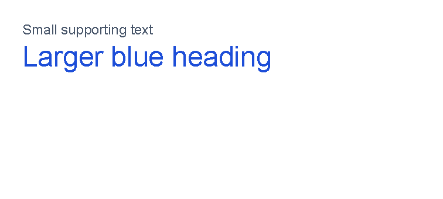
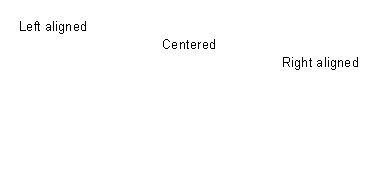
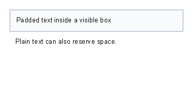
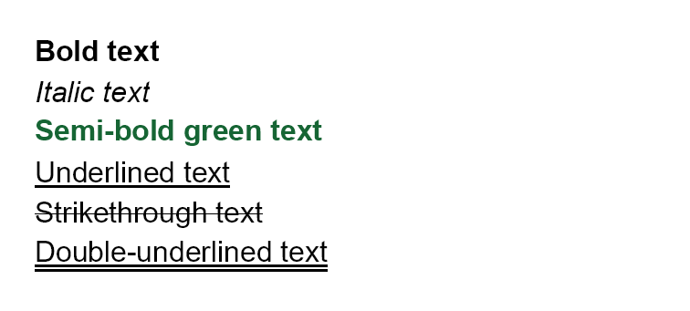

# Text Control

[Controls](controls.md) | [Manual home](index.md)

## What Is This?

The `text` control renders words, labels and values in the document.
It is a leaf control: it displays text content, but it does not contain other controls.

Use `text` for headings, short paragraphs, labels, totals, status messages and values from template data.

## When Should I Use This?

Use `text` whenever the visible document part is text.
If the text needs a surrounding box, background color or border line, put the `text` inside a `border`.
If the text changes for each generated document, insert a template-data value inside the text.

Do not use `text` to build rows and columns.
Use table controls for tabular content.

## How Do I Start?

Start with plain text inside a `body`.

```xml
<?xml version="1.0" encoding="utf-8"?>
<template>
    <body>
        <text fontsize="18">Hello from a template</text>
    </body>
</template>
```


## Change Size And Color

Use `fontsize` for the text size in points.
Use `foreground` for the text color.
See [Layout fundamentals](layout-fundamentals.md) for supported color formats.


```xml
<?xml version="1.0" encoding="utf-8"?>
<template>
    <body>
        <text fontsize="9" foreground="#475569">Small supporting text</text>
        <text fontsize="18" foreground="#1d4ed8">Larger blue heading</text>
    </body>
</template>
```



## Align Text

Use `horizontalAlignment` to place a text control in the available width.
The supported values are `Left`, `Center`, `Right` and `Stretch`.
For the shared alignment model, see [Alignment](layout-fundamentals.md#alignment).


```xml
<?xml version="1.0" encoding="utf-8"?>
<template>
    <body>
        <text fontsize="10" horizontalAlignment="left">Left aligned</text>
        <text fontsize="10" horizontalAlignment="center">Centered</text>
        <text fontsize="10" horizontalAlignment="right">Right aligned</text>
    </body>
</template>
```



## Add Padding Around Text

Use `padding` when text needs reserved space around it.
Padding on plain `text` creates extra space but does not draw a background.
When the padding should be visible, put the text inside a `border` with a background or border color.


```xml
<?xml version="1.0" encoding="utf-8"?>
<template>
    <body>
        <border background="#f8fafc" color="#94a3b8" thickness="1pt" verticalAlignment="top">
            <text fontsize="10" padding="3mm">Padded text inside a visible box</text>
        </border>
        <text fontsize="10" padding="3mm">Plain text can also reserve space.</text>
    </body>
</template>
```



## Make Text Bold Or Italic

Use `weight="bold"` for bold text.
Use `style="italic"` for italic text.
`TextSample.NamedFontWeights`.


```xml
<?xml version="1.0" encoding="utf-8"?>
<template>
    <body>
        <text fontsize="12" weight="bold">Bold text</text>
        <text fontsize="12" style="italic">Italic text</text>
        <text fontsize="12" weight="semiBold" foreground="#166534">Semi-bold green text</text>
    </body>
</template>
```



No `underline` attribute is present on the built-in `TextBaseControl`, so this page does not document underline as
supported.

## Insert Data In Text

Put a variable such as `@CustomerName` where the changing value should appear.
The application must supply the value.


```xml
<?xml version="1.0" encoding="utf-8"?>
<template>
    <body>
        <text fontsize="14">Order @OrderNumber</text>
        <text>Hello @CustomerName</text>
        <text>Delivery: @DeliveryDate</text>
    </body>
</template>
```


The application supplies the values named `OrderNumber`, `CustomerName` and `DeliveryDate`.
For missing values, functions and data-backed attributes, see [Template data](template-data.md).

## Supported Attributes

The examples use lowercase or lower-camel-case attributes.
Parameter binding is case-insensitive, so `fontsize`, `FontSize` and `fontSize` refer to the same text parameter.

| Attribute | Use it for | Values |
|-----------|------------|--------|
| `foreground` | Text color. | Any supported color. |
| `fontsize` | Font size in points. | Number, default `12`. |
| `lineheight` | Distance between wrapped or multi-line text lines, relative to font size. | Number, default `1`. |
| `scale` | Horizontal text scale. | Number, default `1`. |
| `rotation` | Text skew/rotation parameter passed to the renderer. | Number, default `0`. |
| `strokethickness` | Stroke thickness for drawing the text. | Number, default `1`. |
| `letterspacing` | Font width or letter-spacing value. | Number. |
| `weight` | Font weight. | Number or names such as `normal`, `semiBold`, `bold`. |
| `style` | Font slant. | `normal`, `upright`, `italic`, `oblique`. |
| `fontfamily` | Font family. | Font family name available to the renderer. |
| `text` | Text content as an attribute. | Any text. Prefer XML content for normal use. |

The `text` control also supports the shared `margin`, `padding`, `clip`, `horizontalAlignment`
and `verticalAlignment` attributes described in [Layout fundamentals](layout-fundamentals.md).

If both a `text` attribute and XML content are supplied, XML content is used as the control text.

## Allowed Children

`text` does not allow child controls.
Write text directly between the opening and closing tags:

```xml
<text>Use this form for normal text.</text>
```

Do not put controls inside `text`:
use a surrounding `border`, table cell or another container control instead.

## Common Mistakes

- Using `text` when a `border` is needed for background color or a visible box.
- Putting controls inside `text`; use a container control such as `border`, `table` or `td` instead.
- Expecting underline to work as a text attribute; the built-in text control does not expose an underline attribute.
- Writing a long paragraph and assuming it will look right without checking the generated output.

[Controls](controls.md) | [Manual home](index.md)
