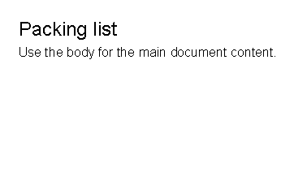
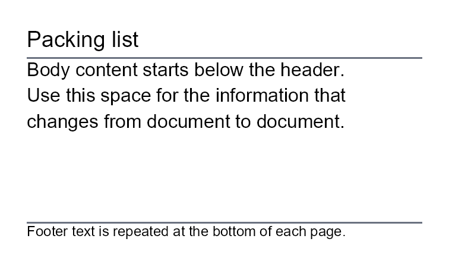
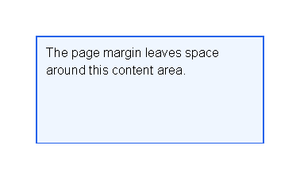
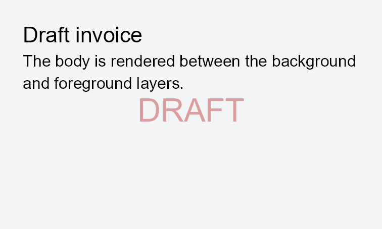

# First Document

Previous: [Introduction](introduction.md) | [Manual home](index.md) | Next: [Areas](areas.md)

## What Is This?

A template is an XML document that describes the generated PDF.
The root element name is flexible; this manual uses `template`.

Inside the root, the usual document sections are `body`, `header`, `footer`,
`background`, `foreground` and `areas`.
The `body` is the main page flow.
The other sections are optional layers or repeated page sections that you add only when the document needs them.

The examples in this manual omit `xmlns` because the XML reader assigns the built-in control namespace
to elements that do not already have an XML namespace.
That lets template authors write `<text>` instead of a longer namespaced element name.
Avoid XML namespace prefixes in normal templates; prefixed control names are not supported by the current reader.

## When Should I Use This?

Use this chapter when you create a new template or need to understand where content belongs in an existing one.
Start with `body`.
Add a header, footer, background, foreground or fixed area only when the document has that specific layout need.

## How Do I Start?

Start with a complete XML file containing one `body` section and one visible control.

```xml
<?xml version="1.0" encoding="utf-8"?>
<template>
    <body>
        <text fontsize="18">Packing list</text>
        <text>Use the body for the main document content.</text>
    </body>
</template>
```



## Choose A Section

| Section | Use it for | Notes |
|---------|------------|-------|
| `body` | Main document content. | Content flows through the available page space and can continue on later pages. |
| `header` | Repeated content at the top of each page. | Keep it short; it is measured inside the top page band. |
| `footer` | Repeated content at the bottom of each page. | Use it for repeated notes, separators or page-number controls. |
| `background` | Page-wide content behind the document. | It is rendered on every page and ignores the normal page margin. |
| `foreground` | Page-wide content above the document. | Use it sparingly for overlays such as draft marks. |
| `areas` | Fixed-position boxes on the page. | Area content is positioned by coordinates and does not follow the body flow. |

## Understand The Default Namespace

Most templates should not set a default XML namespace.
When an element has no namespace, the reader treats it as part of the built-in template namespace
`X39.Solutions.PdfTemplate.Controls`.

For normal template-author work, prefer the unprefixed examples used throughout this manual.

If a template sets a different default namespace, the reader keeps that namespace for the unprefixed elements:

```xml
<template xmlns="MyApp.PdfControls">
    <body>
        <text>This text is no longer in the built-in control namespace.</text>
    </body>
</template>
```

In that example, `text` is read as `MyApp.PdfControls:text`, so the built-in `text` control is not found.

Do not use a prefix such as `pt:text` for built-in controls.
The current reader treats the prefixed element name as `pt:text`, and control names cannot contain `:`.

If your application adds custom controls, ask the application team which unprefixed element names are available.
Developer-facing control registration guidance lives in the [developer integration appendix](developer-integration.md).

## Add A Header And Footer

Use `header` and `footer` for content that should appear around the body on each page.

```xml
<?xml version="1.0" encoding="utf-8"?>
<template>
    <header>
        <text fontsize="14">Packing list</text>
        <line thickness="1pt" length="100%" color="#6b7280"/>
    </header>
    <body>
        <text>Body content starts below the header.</text>
        <text>Use this space for the information that changes from document to document.</text>
    </body>
    <footer>
        <line thickness="1pt" length="100%" color="#6b7280"/>
        <text fontsize="9">Footer text is repeated at the bottom of each page.</text>
    </footer>
</template>
```



## Understand Page Margins

Page margin is document setup, not a `body` control.
The preview below is generated with a wider page margin in the documentation sample options.
The XML places a border in the body; the margin leaves space around the body area.


```xml
<?xml version="1.0" encoding="utf-8"?>
<template>
    <body>
        <border thickness="1pt" color="#2563eb" background="#eff6ff" padding="3mm">
            <text>The page margin leaves space around this content area.</text>
        </border>
    </body>
</template>
```



If your document needs different page margins, use the page setup exposed by your application.
Developer-facing setup details belong in the [developer integration appendix](developer-integration.md).

## Use Background And Foreground Layers

Use `background` for content behind the body and `foreground` for content over the body.
Both layers are repeated on every page.
They are useful for watermarks, draft marks and page-wide marks that should not affect body layout.


```xml
<?xml version="1.0" encoding="utf-8"?>
<template>
    <background>
        <border background="#f3f4f6"/>
    </background>
    <body>
        <text fontsize="16">Draft invoice</text>
        <text>The body is rendered between the background and foreground layers.</text>
    </body>
    <foreground>
        <text
            fontsize="24"
            foreground="#b91c1c66"
            horizontalAlignment="center"
            verticalAlignment="center">DRAFT</text>
    </foreground>
</template>
```



## Use Fixed Areas

Use `areas` when content must sit at a specific page position instead of flowing with the body.
Common examples are approval stamps, fold marks or fixed labels.
Do not use areas for normal paragraphs or tables; keep those in the `body` so they can flow naturally.

To make an area visible, give the `area` a size such as `width` and `height`,
plus a page position such as `top`, `left`, `right` or `bottom`.

```xml
<?xml version="1.0" encoding="utf-8"?>
<template>
    <body>
        <text fontsize="16">Shipping note</text>
        <text>The body uses the normal page flow.</text>
    </body>
    <areas>
        <area width="32mm" height="10mm" right="4mm" top="4mm">
            <border background="#dcfce7" color="#166534" thickness="1pt" padding="2mm">
                <text fontsize="9">APPROVED</text>
            </border>
        </area>
    </areas>
</template>
```


## Next Steps

After the first document structure is clear, read [Areas](areas.md) for fixed-position layout,
[Template data](template-data.md) to insert values,
[Layout fundamentals](layout-fundamentals.md) to adjust spacing and colors,
and [Controls](controls.md) to choose the right XML element for visible content.

Previous: [Introduction](introduction.md) | [Manual home](index.md) | Next: [Areas](areas.md)
