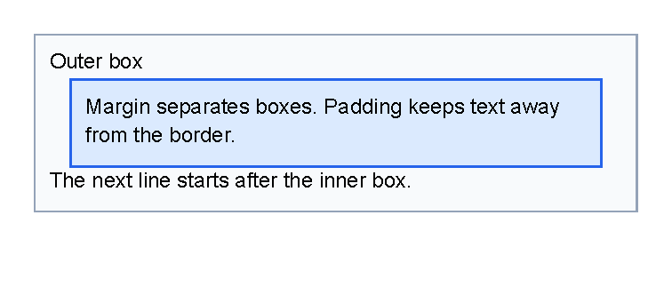
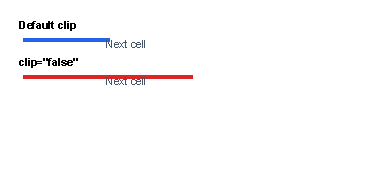
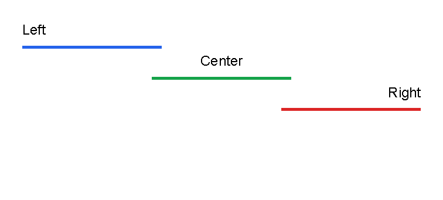
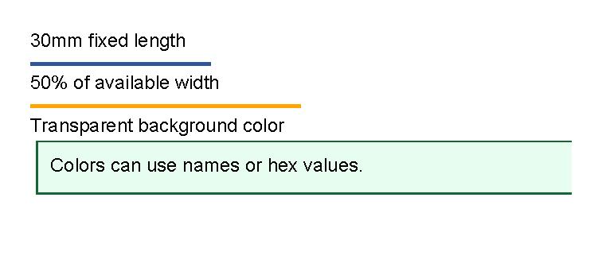

# Layout Fundamentals

Previous: [Template data](template-data.md) | [Manual home](index.md) | Next: [Styles](styles.md)

Status: started. The visual examples on this page are verified by `LayoutDocumentationSamples`.
Length, color, thickness and orientation formats are checked against source, `LengthTests`, `ColorTests`,
`ThicknessParsingTests`, `LineControlTests` and `BarChartTests`.
Shared clipping behavior is checked against `Control`, `BorderControlTests` and `TableCellControlTests`.

## What Is This?

Layout is the way a template uses page space.
It includes the space available to a control, the margin outside a control, the padding inside a control,
border thickness, alignment, length units and colors.

Most layout attributes are written on controls.
For example, a `border` can have `margin`, `padding`, `thickness`, `color`, `background`,
`horizontalAlignment` and `verticalAlignment`.

## When Should I Use This?

Use this chapter when content is too close together, a box is too large, a separator line is not where you expect,
or a color or length value is being adjusted.

Start here before changing a full table or complete document.
One small layout change is easier to understand than many changes at once.

## How Do I Start?

Start with one visible box and change only one spacing value at a time.
This sample is generated by `LayoutDocumentationSamples.Layout_SpacingAndPadding`.

```xml
<?xml version="1.0" encoding="utf-8"?>
<template>
    <body>
        <border
            thickness="1pt"
            color="#94a3b8"
            background="#f8fafc"
            padding="2mm"
            verticalAlignment="top">
            <text fontsize="9">Outer box</text>
            <border
                thickness="1pt"
                color="#2563eb"
                background="#dbeafe"
                margin="3mm 0"
                padding="2mm"
                verticalAlignment="top">
                <text fontsize="9">Margin separates boxes. Padding keeps text away from the border.</text>
            </border>
            <text fontsize="9">The next line starts after the inner box.</text>
        </border>
    </body>
</template>
```



## Available Space

Available space is the size a control receives from its parent area.
In the `body`, this starts as the page size after page margin, header and footer are accounted for.
Inside a container such as `border`, children receive the remaining inner space after the container's border and padding.
Inside a fixed [area](areas.md), children receive the area rectangle as their available space.

Percent lengths use the available width or height for the value being measured.
For example, a horizontal `line` with `length="50%"` uses half of the available width.

## Margin, Padding And Border

Use `margin` to create space outside a control.
Use `padding` to create space between a container edge and its children.
Use `thickness` on `border` when you want the border line itself to be visible.

If a `border` should fit near its content instead of stretching through the available vertical space,
set `verticalAlignment="top"`.

## Clipping And Overflow

Most controls support `clip`.
The default is `true`, which trims drawing to the control's arranged box.
That is usually what you want inside table cells, fixed areas and other tight layouts.

Set `clip="false"` only when overlap is intentional.
Try margin, padding, width or alignment changes first if content is being cut off by accident.

This sample is generated by `LayoutDocumentationSamples.Layout_ClipOverflow`.

```xml
<?xml version="1.0" encoding="utf-8"?>
<template>
    <body>
        <text fontsize="8" weight="bold">Default clip</text>
        <table margin="0 0 2mm 0">
            <tr>
                <td width="22mm" padding="1mm">
                    <line length="45mm" thickness="3pt" color="#2563eb"/>
                </td>
                <td width="1*" padding="1mm">
                    <text fontsize="8" foreground="#475569">Next cell</text>
                </td>
            </tr>
        </table>
        <text fontsize="8" weight="bold">clip="false"</text>
        <table>
            <tr>
                <td width="22mm" padding="1mm" clip="false">
                    <line length="45mm" thickness="3pt" color="#dc2626"/>
                </td>
                <td width="1*" padding="1mm">
                    <text fontsize="8" foreground="#475569">Next cell</text>
                </td>
            </tr>
        </table>
    </body>
</template>
```



## Alignment

Use `horizontalAlignment` to place a control left, center, right or stretched across the available width.
Use `verticalAlignment` to place a control top, center, bottom or stretched across the available height.

The supported values are:

| Attribute | Values |
|-----------|--------|
| `horizontalAlignment` | `Left`, `Center`, `Right`, `Stretch` |
| `verticalAlignment` | `Top`, `Center`, `Bottom`, `Stretch` |

Attribute names and enum values are matched case-insensitively by the control parameter binding path,
but this manual uses lowercase attribute names and title-case enum values for readability.

This sample is generated by `LayoutDocumentationSamples.Layout_Alignment`.

```xml
<?xml version="1.0" encoding="utf-8"?>
<template>
    <body>
        <text fontsize="9">Left</text>
        <line length="35%" thickness="2pt" color="#2563eb" horizontalAlignment="left" margin="0 1mm"/>
        <text fontsize="9" horizontalAlignment="center">Center</text>
        <line length="35%" thickness="2pt" color="#16a34a" horizontalAlignment="center" margin="0 1mm"/>
        <text fontsize="9" horizontalAlignment="right">Right</text>
        <line length="35%" thickness="2pt" color="#dc2626" horizontalAlignment="right" margin="0 1mm"/>
    </body>
</template>
```



## Orientation Values

Some controls use `orientation` to choose the direction of a visual element.
The shared values are checked against `EOrientation`.

| Value | Meaning | Common use |
|-------|---------|------------|
| `Horizontal` | Runs left to right. | Default for `line`. |
| `Vertical` | Runs top to bottom. | Default for `barChart`. |

Use orientation only on controls that document it.
For example, [Line control](controls-line.md) uses it to choose line direction,
and [Chart controls](controls-chart.md) use it for vertical or horizontal bars.

```xml
<line orientation="Vertical" length="25mm" thickness="1pt" color="#475569"/>
```

```xml
<barChart orientation="Horizontal" height="55mm">
    <data x="0" y="12"/>
    <data x="1" y="19"/>
</barChart>
```

## Lengths

Lengths are used for values such as margins, padding, line length, line thickness and area coordinates.

| Format | Meaning | Example |
|--------|---------|---------|
| Number without a unit | Pixels. | `12` |
| `px` | Pixels. | `12px` |
| `pt` | Points. Useful for line thickness and font-related sizing. | `1pt` |
| `mm` | Millimeters. | `5mm` |
| `cm` | Centimeters. | `1cm` |
| `in` | Inches. | `1in` |
| `%` | Percentage of available width or height for that value. | `50%` |
| `auto` | The available size. | `auto` |

This sample is generated by `LayoutDocumentationSamples.Layout_LengthsAndColors`.

```xml
<?xml version="1.0" encoding="utf-8"?>
<template>
    <body>
        <text fontsize="9">30mm fixed length</text>
        <line length="30mm" thickness="2pt" color="#2f5597" margin="0 1mm"/>
        <text fontsize="9">50% of available width</text>
        <line length="50%" thickness="2pt" color="orange" margin="0 1mm"/>
        <text fontsize="9">Transparent background color</text>
        <border
            thickness="1pt"
            color="#166534"
            background="#dcfce7aa"
            padding="2mm"
            margin="1mm 0 0 0"
            verticalAlignment="top">
            <text fontsize="9">Colors can use names or hex values.</text>
        </border>
    </body>
</template>
```



## Colors

Colors can be written as hex values or known color names.

| Format | Example |
|--------|---------|
| Short RGB | `#f00` |
| Short RGBA | `#f00f` |
| RGB | `#ff0000` |
| RGBA | `#ff0000ff` |
| Named color | `red`, `orange`, `black`, `white`, `transparent` |

Use RGBA when you need transparency.
The last two hex digits are the alpha value.

## Thickness Values

`margin`, `padding` and `border` `thickness` use thickness values.
A thickness is one, two or four lengths separated by spaces.

| Format | Meaning | Example |
|--------|---------|---------|
| One value | Same value on all sides. | `2mm` |
| Two values | Left/right first, top/bottom second. | `3mm 1mm` |
| Four values | Left, top, right, bottom. | `1mm 2mm 3mm 4mm` |

Use one value first.
Only use two or four values when the sides really need to differ.

## Common Layout Mistakes

- Using `padding` when you meant outside space. Use `margin` to separate one control from the next.
- Forgetting that page margin is document setup, not a `body` XML attribute. See [First document](first-document.md).
- Expecting page margin to move fixed areas. Area coordinates are measured from the page edge; see [Areas](areas.md).
- Using percentages without checking the parent space. Percentages change when the available area changes.
- Letting a container stretch when it should fit content. Add `verticalAlignment="top"` to a `border` when needed.
- Turning off `clip` to hide a layout problem. Use `clip="false"` only for deliberate overlap.

Use [Styles](styles.md) when the same layout attributes should be reused on many controls.

Previous: [Template data](template-data.md) | [Manual home](index.md) | Next: [Styles](styles.md)
