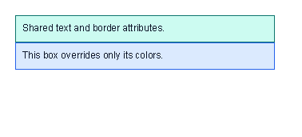

# Styles

Previous: [Layout fundamentals](layout-fundamentals.md) | [Manual home](index.md) | Next: [Controls](controls.md)

Status: started. The visual example on this page is verified by `StyleDocumentationSamples`.
Style ordering, nested style overrides and empty style definitions are checked against `XmlTemplateReaderTests`
and `LineSample`.

## What Is This?

Styles are shared control attributes.
They let a template define defaults once, then reuse those defaults on matching controls that appear later.

A style block is a special child element named after its parent plus `.style`.
For example, use `template.style` inside `template`, `body.style` inside `body`,
or `th.style` inside `th`.

## When Should I Use This?

Use styles when several controls need the same attributes:
repeated text size, table cell padding, line spacing, border colors or clipping settings.

Do not use styles to create content.
Styles only supply attributes for real controls; they do not add text, children, rows or images.

## How Do I Start?

Put `template.style` near the top of the template, before the controls that should use it.
Inside the style block, add empty control elements with the attributes to reuse.

This sample is generated by `StyleDocumentationSamples.Styles_SharedTextAndBorder`.

```xml
<?xml version="1.0" encoding="utf-8"?>
<template>
    <template.style>
        <text fontsize="9" foreground="#0f172a"/>
        <border
            thickness="1pt"
            color="#0f766e"
            background="#ccfbf1"
            padding="2mm"
            margin="0 0 2mm 0"
            verticalAlignment="top"/>
    </template.style>
    <body>
        <border>
            <text>Shared text and border attributes.</text>
        </border>
        <border color="#2563eb" background="#dbeafe">
            <text>This box overrides only its colors.</text>
        </border>
    </body>
</template>
```



Both `border` controls get the shared thickness, padding, margin and top alignment.
The second `border` overrides only `color` and `background`.
Both `text` controls get the shared font size and foreground color.

## Style Scope And Order

A style applies to controls after the style block.
Put the style block before the controls that should use it.

Styles declared in an outer element can apply inside child elements.
A closer style block can override an outer style for the same control type.

Attributes written directly on a control override style attributes for that control.
This is useful when most controls share the same look but one control needs a different color or margin.

## What Can Be Styled?

A style entry uses the same element name as the control it styles.
For example:

```xml
<template.style>
    <text fontsize="9" foreground="#0f172a"/>
    <line thickness="1pt" color="#94a3b8"/>
    <td padding="1mm"/>
</template.style>
```

Only valid attributes for that control can be styled.
A style cannot make an unsupported attribute valid.
Use the focused control pages to check attribute names:
[Text](controls-text.md), [Border](controls-border.md), [Line](controls-line.md),
[Image](controls-image.md), [Page number](controls-page-number.md) and [Table](controls-table.md).

## What Cannot Be Styled?

Style entries cannot contain child controls or text.
Write each style entry as an empty element, such as `<text fontsize="9"/>`.

Styles also cannot define data values, transformer blocks or repeated rows.
Use [Template data](template-data.md) for changing values and [Template language](template-language.md)
for conditions and loops.

## Common Mistakes

- Placing `template.style` after the controls that should use it.
- Writing a style node with the wrong parent name, such as `template.style` inside `body`.
- Putting child controls inside a style entry.
- Expecting styles to create visible content by themselves.
- Styling an attribute that the real control does not support.

Previous: [Layout fundamentals](layout-fundamentals.md) | [Manual home](index.md) | Next: [Controls](controls.md)
