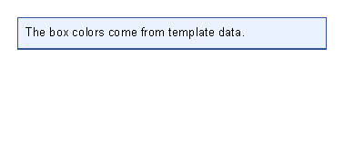

# Template Data

Previous: [Areas](areas.md) | [Manual home](index.md) | Next: [Layout fundamentals](layout-fundamentals.md)

## What Is This?

Template data is information supplied by the application when it generates a document.
The XML template reads that information with names that start with `@`.

Use template data for values that change from one generated PDF to the next:
customer names, order numbers, dates, totals, colors, status labels and similar document content.

## When Should I Use This?

Use template data when the document design stays the same but the values change.
For example, the template can say where the order number belongs, while the application supplies the actual order number.

Do not hard-code changing business data in the XML.
Hard-coded text is fine for labels such as `Order`, `Total` or `Delivery`.

## How Do I Start?

Start with a simple variable in a `text` control.

```xml
<?xml version="1.0" encoding="utf-8"?>
<template>
    <body>
        <text fontsize="14">Order @OrderNumber</text>
        <text>Hello @CustomerName</text>
        <text>Delivery: @DeliveryDate</text>
    </body>
</template>
```


The application must supply values named `OrderNumber`, `CustomerName` and `DeliveryDate`.
If you do not know the available names, ask the application team for the template data list.

## Common Data Tasks

Use this table to choose the smallest next step:

| Task | Start here |
|------|------------|
| Show a value inside text. | [Variable names](#variable-names) and [Text control: insert data in text](controls-text.md#insert-data-in-text). |
| Use data for a color, length or other attribute. | [Data in attributes](#data-in-attributes). |
| Call an application-supplied formatter or calculation. | [Functions](#functions). |
| Hide a section unless a value exists. | [Optional values](#optional-values) and [Show optional values with `@if`](template-language.md#show-optional-values-with-if). |
| Choose between several status messages. | [Expressions in transformer lines](#expressions-in-transformer-lines) and [Choices with `@switch`](template-language.md#choices-with-switch). |
| Repeat content for a list. | [Lists](#lists) and [Table control: repeat rows from data](controls-table.md#repeat-rows-from-data). |
| Ask for nested or multi-field values. | [Nested data](#nested-data). |

## The Data Contract

A template works best when the application team gives template authors a small data contract:
the names, value types and formats that may appear in the XML.

Ask for the contract in template-author language:

| Need in the template | Ask the application for |
|----------------------|-------------------------|
| Printed values | Simple text, date or number values such as `CustomerName`, `InvoiceNumber` or `TotalLabel`. |
| Colors, lengths or spacing | Values already formatted for the target attribute, such as `#2f5597` for a color. |
| Optional sections | Boolean flags such as `HasPurchaseOrder`, or Boolean helper functions such as `hasPurchaseOrder()`. |
| Status choices | A short status value such as `paid`, `pending` or `draft` for `@switch`. |
| Repeated rows | A collection for `@foreach`; prefer ready-to-print item values unless a supported multi-field pattern is documented. |
| Formatting or calculations | A named function such as `statusLabel(PaymentStatus)`. |

This page documents the supported starter shapes.
If a template needs a new value name or a new helper function, the application team must expose it before the XML can
use it.

## Variable Names

A variable is inserted with `@VariableName`.
Use clear names that describe the value, such as `CustomerName`, `InvoiceNumber` or `DueDate`.

Prefer letters, numbers and underscores for new variable names.
Hyphens are accepted by the text parser, but they can make punctuation near a variable harder to read.
Avoid dots in variable names for text content. In text, `@Customer.Name` is read as `@Customer` followed by the
literal `.Name` text.

When a variable appears in the middle of a sentence, put whitespace before the `@`.
For example, `Order @OrderNumber` is easier for the template reader to recognize than attaching the variable directly
to the previous word.

## When Data Is Missing

Missing data behaves differently in text and attributes.
Design templates so optional values are intentional and easy to notice.

In normal text, a missing variable remains visible as the original `@Name` text:

```xml
<template>
    <body>
        <text>Order @MissingOrderNumber is still pending</text>
    </body>
</template>
```

If the generated document still shows `@OrderNumber`, the application did not supply a matching value for that name.

In an attribute that starts with `@`, a missing variable becomes an empty attribute value before the control reads it:

```xml
<template>
    <body>
        <text color="@MissingColor">Color uses template data</text>
    </body>
</template>
```

The control may reject the empty value later if that attribute needs a valid color, length, number or Boolean.

Do not use a missing or optional text value as an automatic fallback rule.
Ask the application team for one of these instead:

- A complete display value, such as `OrderNumberLabel`, that already includes the fallback text.
- A Boolean flag, such as `HasOrderNumber`, for `@if`.
- A helper function, such as `hasOrderNumber()`, when the application owns the check.

## Data In Attributes

Some attributes can also read template data.
Use this when the application decides a value such as a color.


```xml
<?xml version="1.0" encoding="utf-8"?>
<template>
    <body>
        <border
            thickness="1pt"
            color="@AccentBorder"
            background="@AccentBackground"
            padding="2mm"
            verticalAlignment="top">
            <text fontsize="10">The box colors come from template data.</text>
        </border>
    </body>
</template>
```



In this example, `AccentBorder` must contain a valid color value such as `#2f5597`,
and `AccentBackground` must contain a valid color value such as `#eaf2ff`.
See [Layout fundamentals](layout-fundamentals.md) for color formats.

Attribute values are evaluated as expressions only when the attribute value starts with `@`.
Use the whole attribute for the data value, as in `color="@AccentBorder"`.
Do not mix fixed text and data in the same attribute unless a control page documents that exact pattern.
This behavior is checked in `XmlTemplateReader.TransformNodeAsync`.

## Functions

Functions are named operations supplied by the application.
They look like variable names followed by parentheses, such as `@total()` or `@formatDate(DateValue)`.

Use a function when a value needs to be calculated or formatted by the application.
The exact function names and arguments depend on the application that generates the PDF.
Ask the application team which functions are available for your templates.

It assumes the application supplies a function named `statusLabel` and a variable named `PaymentStatus`.

```xml
<?xml version="1.0" encoding="utf-8"?>
<template>
    <body>
        <text fontsize="14">Invoice status</text>
        <text>Status: @statusLabel(PaymentStatus)</text>
    </body>
</template>
```


Inside the parentheses, write the variable name without a leading `@`.

Two diagnostic functions are registered for every generator: `allFunctions()` and `allVariables()`.
They expose the currently registered function names and variable names.
Use them only while checking a data contract with the application team; production templates should use the specific
variables and functions documented for that document type.

## Expressions In Transformer Lines

Transformer lines such as `@if`, `@switch`, `@foreach` and `@var` read expressions through the template data system.
In those lines, write variable names without the leading `@`.
Inside visible text or attributes, keep the leading `@` when you want to print or apply a value.

Use this shape for conditions:

```xml
<template>
    <body>
        @if HasBalanceDue {
            <text>Payment required</text>
        }
    </body>
</template>
```

`HasBalanceDue` must be a Boolean value.

Use this shape for choices:

```xml
<template>
    <body>
        @switch Status {
            @case "paid" {
                <text>Paid</text>
            }
            @default {
                <text>Status needs review</text>
            }
        }
    </body>
</template>
```

For the full transformer syntax, see [Template language](template-language.md).

## Optional Values

When a value may be blank or unavailable, ask the application team for an explicit flag or function.
This keeps the template readable and avoids guessing how missing data should behave.

Use this pattern when the section should disappear unless the application says the value is present:

```xml
<template>
    <body>
        @if HasPurchaseOrder {
            <text>Purchase order: @PurchaseOrder</text>
        }
    </body>
</template>
```

`HasPurchaseOrder` must be a Boolean value.
`PurchaseOrder` is the text value to print.

Do not write `@if PurchaseOrder` to mean "show this when PurchaseOrder has text".
comparison operator must evaluate to a Boolean, not a text value.
For the template-language view of this task, see
[Show optional values with @if](template-language.md#show-optional-values-with-if).

## Lists

Use `@foreach` when the application supplies a list and the template should repeat one small block for each item.

```xml
<template>
    <body>
        @foreach Task in Tasks {
            <text>@Task</text>
        }
    </body>
</template>
```

`Tasks` must be a collection.
Each item is temporarily available as `Task` inside the block.
[repeated table rows](controls-table.md#repeat-rows-from-data) sample uses the same simple-item pattern.

If each item needs several fields, ask for simple display values or helper functions until the application documents a
supported multi-field item pattern for template authors.
Do not assume `@Task.Name` reads a field from the current item.

## Nested Data

For missing simple variables, see [A value prints empty or does not change](troubleshooting.md#a-value-prints-empty-or-does-not-change).

The current XML reader does not provide template-author property access such as `@Customer.Name` in text.
Use simple values supplied by the application instead:

```xml
<template>
    <body>
        <text>@CustomerName</text>
        <text>@CustomerStreet</text>
        <text>@CustomerCity</text>
    </body>
</template>
```


If the application has nested customer or invoice objects, ask the application team to expose the fields you need as
simple variables, or to provide a function that returns a ready-to-print value.
`Customer.Name` is not read by text replacement.
an attribute such as `color="@Customer.Color"` is evaluated as the exact variable name `Customer.Color`, not as a
property lookup on `Customer`.
For new templates, prefer simple names such as `CustomerColor` so text and attributes follow the same naming pattern.

## Next Steps

Read [Template language](template-language.md) when you need conditions or loops.
Read [Layout fundamentals](layout-fundamentals.md) when a data value controls a color, length or spacing value.

Previous: [Areas](areas.md) | [Manual home](index.md) | Next: [Layout fundamentals](layout-fundamentals.md)
