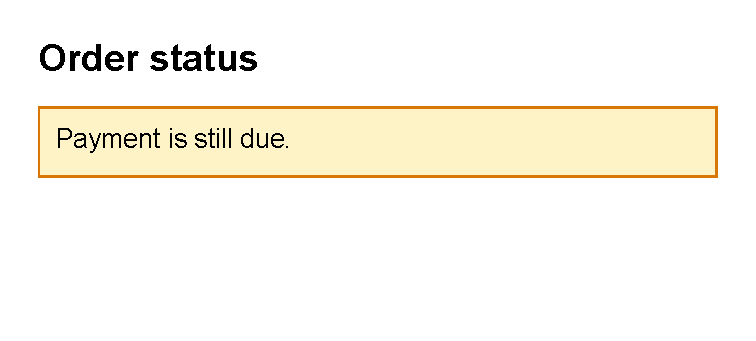
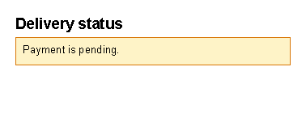

# Template Language

Previous: [Transformers](transformers.md) | [Manual home](index.md) | Next: [Complete examples](complete-examples.md)

Status: started. Starter transformer examples are checked against `IfTransformerTests`,
`SwitchTransformerTests`, `ForTransformerTests`, `ForEachTransformerTests`, `VariableTransformerTests`
and `AlternateTransformer`. The conditional section task sample is generated by
`TemplateLanguageDocumentationSamples.TemplateLanguage_ConditionalSection`, and the switch task sample is generated by
`TemplateLanguageDocumentationSamples.TemplateLanguage_SwitchStatus`. Optional-value `@if` patterns are checked by
`IfTransformerTests.IfConditionUsesBooleanVariable`, `IfTransformerTests.IfConditionUsesBooleanFunction` and
`IfTransformerTests.IfConditionWithoutOperatorRejectsNonBooleanVariable`. Dotted variable behavior is checked by
`GeneralExpressionTests`.

## What Is This?

The template language changes XML before controls are created.
Its transformer blocks can include content conditionally, choose between alternatives,
repeat content for a range or list, alternate values, and define temporary variables.

Built-in transformer names are `alternate`, `var`, `if`, `switch`, `for` and `foreach`.

## When Should I Use This?

Use this chapter when the document needs different content for different data,
or when the same XML pattern should be repeated.
Typical examples include optional sections, status-specific labels, invoice rows and alternating table row colors.

## How Do I Start?

Start with the simplest transformer that matches the task:

- Use `@if` for optional content.
- Use `@switch` for several alternatives.
- Use `@foreach` for a list supplied by template data.
- Use `@for` for a numeric range.
- Use `@var` to give a short temporary name to a value.
- Use `@alternate` to rotate between values, such as repeated row colors.

In transformer lines, write expression variable names without `@`.
Inside rendered text or attributes, keep using `@VariableName` to insert the value.

For example, this `@if` line reads the `ShowDiscount` value, while the `text` control prints normal text:

```xml
<template>
    <body>
        @if ShowDiscount {
            <text>Discount included</text>
        }
    </body>
</template>
```

The application must supply `ShowDiscount` as a Boolean value.

## Conditions With `@if`

Use `@if` when a section should appear only when a condition is true.
Use `@else if` and `@else` when the template needs a fallback.

Use this pattern for optional notices, paid/unpaid messages, approval labels or other content that should depend on
one value supplied by the application.

```xml
<template>
    <body>
        @if BalanceDue &gt; 0 {
            <text>Payment required</text>
        }
        @else if BalanceDue == 0 {
            <text>Paid in full</text>
        }
        @else {
            <text>Credit balance</text>
        }
    </body>
</template>
```

Because templates are XML, write `<` as `&lt;` and `>` as `&gt;` inside XML text.
Supported comparison operators are `>`, `<`, `>=`, `<=`, `==`, `!=`, `===`, `!==` and `in`.
String equality with `==` and `!=` is case-insensitive; use `===` or `!==` when exact casing matters.

This complete sample chooses one visible message from a Boolean value named `HasBalanceDue`:

```xml
<?xml version="1.0" encoding="utf-8"?>
<template>
    <body>
        <text fontsize="14" weight="bold">Order status</text>
        @if HasBalanceDue {
        <border
            background="#fef3c7"
            color="#d97706"
            thickness="1pt"
            padding="2mm"
            margin="0 0 0 2mm"
            verticalAlignment="top">
            <text fontsize="10">Payment is still due.</text>
        </border>
        }
        @else {
        <border
            background="#dcfce7"
            color="#16a34a"
            thickness="1pt"
            padding="2mm"
            margin="0 0 0 2mm"
            verticalAlignment="top">
            <text fontsize="10">Paid in full.</text>
        </border>
        }
    </body>
</template>
```

The application supplies `HasBalanceDue` as a Boolean.
When it is `true`, the first `border` is included; otherwise, the `@else` border is included.
Leave out the `@else` block when the section should simply disappear.



## Show Optional Values With `@if`

Use an application-supplied Boolean when a section should appear only if an optional value exists.
Do not use the text value itself as a truthy check.

```xml
<template>
    <body>
        @if HasPurchaseOrder {
            <text>Purchase order: @PurchaseOrder</text>
        }
    </body>
</template>
```

The application supplies both values:

- `HasPurchaseOrder`: `true` when the value should be shown.
- `PurchaseOrder`: the text to print.

`IfTransformerTests.IfConditionUsesBooleanVariable` verifies this pattern.
When an `@if` expression has no comparison operator, it must evaluate to `true` or `false`.
`IfTransformerTests.IfConditionWithoutOperatorRejectsNonBooleanVariable` verifies that a normal text value such as
`PurchaseOrder` is not accepted as an existence check.

If the application exposes a helper function, the same idea can be written with a function that returns a Boolean:

```xml
<template>
    <body>
        @if hasPurchaseOrder() {
            <text>Purchase order: @PurchaseOrder</text>
        }
    </body>
</template>
```

`IfTransformerTests.IfConditionUsesBooleanFunction` verifies that function-backed Boolean conditions work.
Ask the application team which optional-value flags or helper functions are available.

## Choices With `@switch`

Use `@switch` when one value chooses between several branches.
The first matching `@case` is used.
If no case matches, the optional `@default` branch is used.

```xml
<template>
    <body>
        @switch Status {
            @case "paid" {
                <text>Paid</text>
            }
            @case "pending" {
                <text>Pending</text>
            }
            @default {
                <text>Status needs review</text>
            }
        }
    </body>
</template>
```

`@case` and `@default` belong inside `@switch`; they are not standalone transformers.
Put `@default` last, and use it only once.
Cases without an explicit operator use `==`.
Cases can also use operators such as `@case &gt; 3` or `@case in AllowedStatuses`.

This complete sample chooses one status box from a value named `Status`.
It is generated by `TemplateLanguageDocumentationSamples.TemplateLanguage_SwitchStatus`.

```xml
<?xml version="1.0" encoding="utf-8"?>
<template>
    <body>
        <text fontsize="14" weight="bold">Delivery status</text>
        @switch Status {
        @case "paid" {
        <border background="#dcfce7" color="#16a34a" thickness="1pt" padding="2mm" verticalAlignment="top">
            <text fontsize="10">Paid and ready to ship.</text>
        </border>
        }
        @case "pending" {
        <border background="#fef3c7" color="#d97706" thickness="1pt" padding="2mm" verticalAlignment="top">
            <text fontsize="10">Payment is pending.</text>
        </border>
        }
        @default {
        <border background="#f1f5f9" color="#64748b" thickness="1pt" padding="2mm" verticalAlignment="top">
            <text fontsize="10">Status needs review.</text>
        </border>
        }
        }
    </body>
</template>
```



`SwitchTransformerTests.SwitchMatchesStringCase` verifies that string cases use case-insensitive matching.
`SwitchTransformerTests.SwitchUsesDefaultWhenNoCaseMatches` verifies the fallback branch.

## Lists With `@foreach`

Use `@foreach` when the application supplies a list and the template should render one block per item.

```xml
<template>
    <body>
        @foreach Line in Lines {
            <text>@Line</text>
        }
    </body>
</template>
```

The application must supply `Lines` as a collection.
The transformer creates a temporary variable named `Line` for each item.
For a table-row example backed by generated output, see [Repeat rows from data](controls-table.md#repeat-rows-from-data).

If each list item has several fields, do not assume `@Line.Description` reads a property.
The current verified behavior treats dots as punctuation in text, not as property access.
Ask the application team to supply simple display values, or a function that returns the exact value the template
should print.
See [Nested data](template-data.md#nested-data).

Add `with Index` when the template also needs a zero-based counter:

```xml
<template>
    <body>
        @foreach Line in Lines with Index {
            <text>@Index: @Line</text>
        }
    </body>
</template>
```

## Numeric Ranges With `@for`

Use `@for` for a simple numeric range that is part of the template design.
Use `@foreach` for real data lists such as invoice rows.

```xml
<template>
    <body>
        @for Step from 1 to 4 {
            <text>Step @Step</text>
        }
    </body>
</template>
```

The end value is not included, so this example emits steps 1, 2 and 3.
Use `step` to skip values:

```xml
<template>
    <body>
        @for Step from 0 to 10 step 2 {
            <text>Step @Step</text>
        }
    </body>
</template>
```

When counting down, use a negative step:

```xml
<template>
    <body>
        @for Step from 3 to 0 step -1 {
            <text>Step @Step</text>
        }
    </body>
</template>
```

## Temporary Values With `@var`

Use `@var` to give a short temporary name to an expression inside one block.
This can make repeated text easier to read.

```xml
<template>
    <body>
        @var Label = "Invoice total" {
            <text>@Label</text>
        }
    </body>
</template>
```

You can define more than one temporary value in the same block:

```xml
<template>
    <body>
        @var Label = "Customer", Value = CustomerName {
            <text>@Label: @Value</text>
        }
    </body>
</template>
```

`CustomerName` must be supplied by the application.

## Alternating Values With `@alternate`

Use `@alternate` when repeated XML should rotate through a small set of values.
The common document use is alternating table row colors.

```xml
<template>
    <body>
        @alternate on RowLabel with ["Odd", "Even"] {
            <text>@RowLabel row</text>
        }
        @alternate on RowLabel {
            <text>@RowLabel row</text>
        }
        @alternate on RowLabel {
            <text>@RowLabel row</text>
        }
    </body>
</template>
```

The first block supplies the value list.
Later `@alternate on RowLabel` blocks advance to the next value.
The list starts over when it reaches the end.

Use `repeat` when a second block should reuse the current value instead of advancing:

```xml
<template>
    <body>
        @alternate on RowLabel with ["Odd", "Even"] {
            <text>@RowLabel title</text>
        }
        @alternate repeat on RowLabel {
            <text>@RowLabel detail</text>
        }
    </body>
</template>
```

## Common Mistakes

- Do not write `@` before variable names in transformer expressions. Use `@if ShowDiscount`, not `@if @ShowDiscount`.
- Use `@else if`, not bare `else if`.
- Put `@default` last inside `@switch`.
- Use `@foreach` only with a value that is a collection.
- In XML text, write `<` as `&lt;` and `>` as `&gt;`.

## Planned Work

- Add task examples for multi-field rows or nested data conditions after a supported pattern is implemented or
  verified.
- Keep transformer examples small and focused on document-authoring tasks.

Previous: [Transformers](transformers.md) | [Manual home](index.md) | Next: [Complete examples](complete-examples.md)
